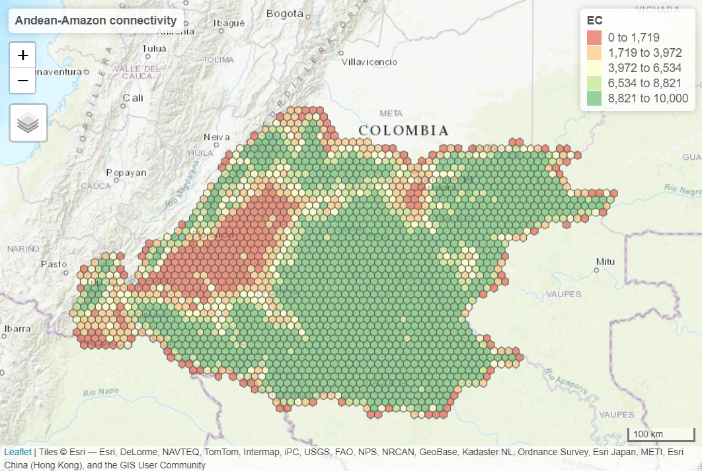

[](https://ci.appveyor.com/project/OscarGOGO/Makurhini)

<!-- README.md is generated from README.Rmd. Please edit that file -->

```{r, include = FALSE}
knitr::opts_chunk$set(
  collapse = TRUE,
  comment = "#>",
  fig.path = "man/figures/README-",
  out.width = "70%",
  message=FALSE, warning=FALSE
)
```
# Makurhini: Analyzing landscape connectivity.


## Overview
<strong>Makurhini</strong> *(Connect in Purépecha language)* is an R package for calculating fragmentation and landscape connectivity indices used in conservation planning. Makurhini provides a set of functions to identify connectivity of protected areas networks and the importance of landscape elements for maintaining connectivity. This package allows the evaluation of scenarios under landscape connectivity changes and presents an additional improvement, the inclusion of landscape heterogeneity as a constraining factor for connectivity.

The network connectivity indices calculated in Makurhini package have been previously published (e.g., Pascual-Hortal & Saura, 2006. *Landscape ecology*, https://doi.org/10.1007/s10980-006-0013-z; Saura & Pascual-Hortal, 2007. *Lanscape and urban planning*, https://doi.org/10.1016/j.landurbplan.2007.03.005; Saura & Rubio, 2010. *Ecography*, https://doi.org/10.1111/j.1600-0587.2009.05760.x; Saura et al., 2011. *Ecological indicators*, https://doi.org/10.1016/j.ecolind.2010.06.011; Saura et al., 2017. *Ecological indicators*, http://dx.doi.org/10.1016/j.ecolind.2016.12.047; Saura et al., 2018. *Biological conservation*, https://doi.org/10.1016/j.biocon.2017.12.020), and it allows the integration of efficient and useful workflow for landscape management and monitoring of global conservation targets.

### Citing Makurhini package
A formal paper detailing this packe is forthcoming, but until it is published, please use the something like the following to cite if you use it in your work:

<code> <i> Godínez-Gómez, O. and Correa Ayram C.A. 2020. Makurhini: Analyzing landscape connectivity. [](https://doi.org/10.5281/zenodo.3749434) </code> </i>


## Installation
* Pre-install [Rtools](https://cran.r-project.org/bin/windows/Rtools/).
* Pre-install devtools (<code>install.packages("devtools")</code>) and
remotes (<code>install.packages("remotes")</code>) packages. 

You can install the released version of Makurhini from [GitHub](https://github.com) with:

``` r
library(devtools)
library(remotes)
install_github("connectscape/Makurhini", dependencies = TRUE, upgrade = "never")
```
In case it does not appear in the list of packages, close the R session and reopen.

## Summary of main *Makurhini* functions

```{r echo=FALSE}
library(formattable)
functions_MK <- data.frame(Function = c("MK_Fragmentation", "distancefile", "MK_RMCentrality", "MK_dPCIIC", "MK_dECA", "MK_ProtConn", "MK_ProtConnMult", "MK_Connect_grid", "test_metric_distance"), Purpose = c("Calculate patch and landscape statistics (e.g., mean size patches, edge density, core area percent, shape index, fractal dimension index, effective mesh size).", "Get a table or matrix with the distances between pairs of nodes. Two Euclidean distances ('centroid' and 'edge') and two cost distances that consider the landscape heterogeneity ('least-cost' and 'commute-time, this last is analogous to the resistance distance of circuitscape, see ’gdistance’ package).", "Estimate centrality measures under one or several dispersal distances (e.g., betweenness centrality, node memberships, modularity). It uses the 'distancefile ()' to calculate the distances of the nodes so they can be calculated using Euclidean or cost distances that consider the landscape heterogeneity.", "Calculate the integral index of connectivity (IIC) and probability of connectivity (PC) indices under one or several dispersal distances. It computes overall and index fractions (dPC or dIIC, intra, flux and connector) and the effect of restauration in the landscape connectivity when adding new nodes (restoration scenarios). It uses the 'distancefile()'.", "Estimate the Equivalent Connected Area (ECA) and compare the relative change in ECA (dECA) between time periods using one or several dispersal distances. It uses the 'distancefile()'.", "Estimate the Protected Connected (ProtConn) indicator and fractions for one region using one or several dispersal distances and transboundary buffer areas (e.g., ProtConn, ProtUnconn, RelConn, ProtConn[design], ProtConn[bound], ProtConn[Prot], ProtConn[Within], ProtConn[Contig], ProtConn[Trans], ProtConn[Unprot]). It uses the 'distancefile()", "Estimate the ProtConn indicator and fractions for multiple regions. It uses the 'distancefile()'.", "Compute the ProtConn indicator and fractions, PC or IIC overall connectivity metrics (ECA) in a regular grid. It uses the 'distancefile()'.", "Compare ECA or ProtConn connectivity metrics using one or up to four types of distances, computed in the 'distancefile()' function, and multiple dispersion distances."))

formattable(functions_MK,  align =c("l","l"), list(`Function` = formatter(
              "span", style = ~ style(font.style = "italic"))))
```

## Example
This is a basic example which shows you how to solve some common problems:

* Protected Connected Land (<i>ProtConn</i>)
* Equivalent Connectivity Area (<i>ECA</i>)
* Integral index of connectivity (<i>IIC</i>) and fractions (<i>dIICintra, dIICflux and dIICconnector</i>)
* Probability of connectivity (<i>PC</i>) and fractions (<i>dPCintra, dPCflux and dPCconnector</i>)
* Centrality measures (e.g., betweenness centrality, node memberships, and modularity)


### Protected Connected Land (ProtConn)

```{r echo=FALSE}
library(Makurhini)
library(raster)
library(rgeos)
library(sf)
library(tmap)
library(mapview)
library(classInt)
```

En el siguiente ejemplo, calcularemos el índicador ProtConn y sus fracciones para cuatro ecorregiones del amazonas colombiano y áreas protegidas de Colombia y de los paises vecinos en un buffer de 50 km.

```{r echo=FALSE}
ecoregions <- read_sf("D:/Paper_Makurhini/Ejemplos/Ecoregiones_Colombia_amazonas.shp")
Protected_areas <- read_sf("D:/Paper_Makurhini/Ejemplos/PAs_Colombia_amazonas.shp")
```


```{r }
test_protconn <- MK_ProtConnMult(nodes = Protected_areas, region = ecoregions,
                    attribute = "Intersected area", area_unit = "ha",
                    distance = list(type= "centroid"),
                    distance_thresholds = 10000,
                    probability = 0.5, transboundary = 50000,
                    plot = TRUE, CI = NULL, parallel = TRUE, intern = FALSE)
test_protconn[[1]][[1]]
```


ProtConn value:


###  Equivalent Connectivity Area (ECA)

Example in the Biosphere Reserve Mariposa Monarca, Mexico, with old-growth vegetation fragments of four times (?list_forest_patches).

```{r polygons}
data("list_forest_patches", package = "Makurhini")
data("study_area", package = "Makurhini")

Max_attribute <- unit_convert(gArea(study_area), "m2", "ha")
```

```{r }
dECA_test <- MK_dECA(nodes= list_forest_patches, attribute = NULL, area_unit = "ha",
                  distance = list(type= "centroid"), metric = "PC",
                  probability = 0.05, distance_thresholds = 5000,
                  LA = Max_attribute, plot= c("1993", "2003", "2007", "2011"))
dECA_test
```


Another way to analyze the ECA (and ProtConn indicator) is by using the *'MK_Connect_grid()'* that estimates the index values on a grid. An example of its application is the following, on the Andean-Amazon Piedmont. The analysis was performed using a grid of hexagons each with an area of 10,000 ha and a forest/non-forest map to measure changes in Andean-Amazon connectivity.




###  Integral index of connectivity (IIC) and fractions (Intra, Flux and Connector)

Example with 142 old-growth vegetation fragments in southeast Mexico (?vegetation_patches).

```{r }
data("vegetation_patches", package = "Makurhini")
nrow(vegetation_patches) # Number of patches

IIC <- MK_dPCIIC(nodes = vegetation_patches, attribute = NULL,
                distance = list(type = "centroid"),
                metric = "IIC", distance_thresholds = 10000) #10 km
head(IIC)
```

```{r echo=FALSE, out.width = "100%"}
library(classInt)
tmap_mode("plot")
c <-9
diic <- tm_shape(IIC) + tm_fill("dIIC", palette = RColorBrewer::brewer.pal(c, "RdYlGn"),
                            breaks =  classIntervals(IIC$dIIC, c, "jenks")[[2]])+ 
  tm_style("cobalt")+ tm_layout(legend.width = 0.43, legend.height = 0.43)

dintra <- tm_shape(IIC) + tm_fill("dIICintra", palette = RColorBrewer::brewer.pal(c, "RdYlGn"), breaks =  classIntervals(IIC$dIICintra, c, "jenks")[[2]])+ 
  tm_style("cobalt")+ tm_layout(legend.width = 0.43, legend.height = 0.43)

dflux <- tm_shape(IIC) + tm_fill("dIICflux", palette = RColorBrewer::brewer.pal(c, "RdYlGn"), breaks =  classIntervals(IIC$dIICflux, c, "jenks")[[2]])+ tm_style("cobalt")+ tm_layout(legend.width = 0.43, legend.height = 0.43)

dconect <- tm_shape(IIC) + tm_fill("dIICconnector", palette = RColorBrewer::brewer.pal(c, "RdYlGn"), breaks =  classIntervals(IIC$dIICconnector, c, "jenks")[[2]])+ tm_style("cobalt")+ tm_layout(legend.width = 0.43, legend.height = 0.43)
  
tmap_arrange(diic, dintra, dflux, dconect)
```


###  Probability of connectivity (PC) and fractions (Intra, Flux and Connector)

```{r }
PC <- MK_dPCIIC(nodes = vegetation_patches, attribute = NULL,
                distance = list(type = "centroid"),
                metric = "PC", probability = 0.05,
                distance_thresholds = 10000)
head(PC)
```

```{r echo=FALSE, out.width = "100%"}
dpc <- tm_shape(PC) + tm_fill("dPC", palette = RColorBrewer::brewer.pal(c, "RdYlGn"),
                            breaks =  classIntervals(PC$dPC, c, "jenks")[[2]])+ 
  tm_style("cobalt")+ tm_layout(legend.width = 0.43, legend.height = 0.43)

dintra <- tm_shape(PC) + tm_fill("dPCintra", palette = RColorBrewer::brewer.pal(c, "RdYlGn"), breaks =  classIntervals(PC$dPCintra, c, "jenks")[[2]])+ 
  tm_style("cobalt")+ tm_layout(legend.width = 0.43, legend.height = 0.43)

dflux <- tm_shape(PC) + tm_fill("dPCflux", palette = RColorBrewer::brewer.pal(c, "RdYlGn"),
                                 breaks =  classIntervals(PC$dPCflux, c, "jenks")[[2]])+ 
  tm_style("cobalt")+ tm_layout(legend.width = 0.43, legend.height = 0.43)

PC$'-log(dPCconnector)' <- lapply(PC$dPCconnector, function(x)if(x>0){-log(x)}else{0}) %>% 
  do.call(rbind, .) %>% as.vector()

dconect <-tm_shape(PC) + tm_fill("-log(dPCconnector)", palette = RColorBrewer::brewer.pal(5, "RdYlGn"), breaks =  classIntervals(PC$`-log(dPCconnector)`, 5, "quantile")[[2]], legend.show = T)+ tm_style("cobalt")+ tm_layout(legend.width = 0.3, legend.height = 0.3)
  
tmap_arrange(diic, dintra, dflux, dconect)
```

###  Centrality measures

```{r }
centrality_test <- MK_RMCentrality(nodes = vegetation_patches,
                                distance = list(type = "centroid"),
                                 distance_thresholds = 10000,
                                 probability = 0.05,
                                 write = NULL)
head(centrality_test)
```


Examples:


```{r echo=FALSE, out.width = "100%"}
clustertest <- tm_shape(centrality_test) + tm_fill("cluster", palette = RColorBrewer::brewer.pal(c, "PuOr"), breaks =  classIntervals(centrality_test$cluster, c, "jenks")[[2]])+ tm_style("cobalt")+ tm_layout(legend.width = 0.43, legend.height = 0.43)

modules <- tm_shape(centrality_test) + tm_fill("modules", palette = RColorBrewer::brewer.pal(c, "PuOr"), breaks =  classIntervals(centrality_test$modules, c, "jenks")[[2]])+ tm_style("cobalt")+ tm_layout(legend.width = 0.43, legend.height = 0.43)

tmap_arrange(clustertest, modules)
```


Moreover, you can change distance using the distance (<code>?distancefile</code>) argument:

Euclidean distances:

* distance = list(type= "centroid")
* distance = list(type= "edge")

Least cost distances:

* distance = list(type= "least-cost", resistance = "resistance raster")
* distance = list(type= "commute-time", resistance = "resistance raster")
