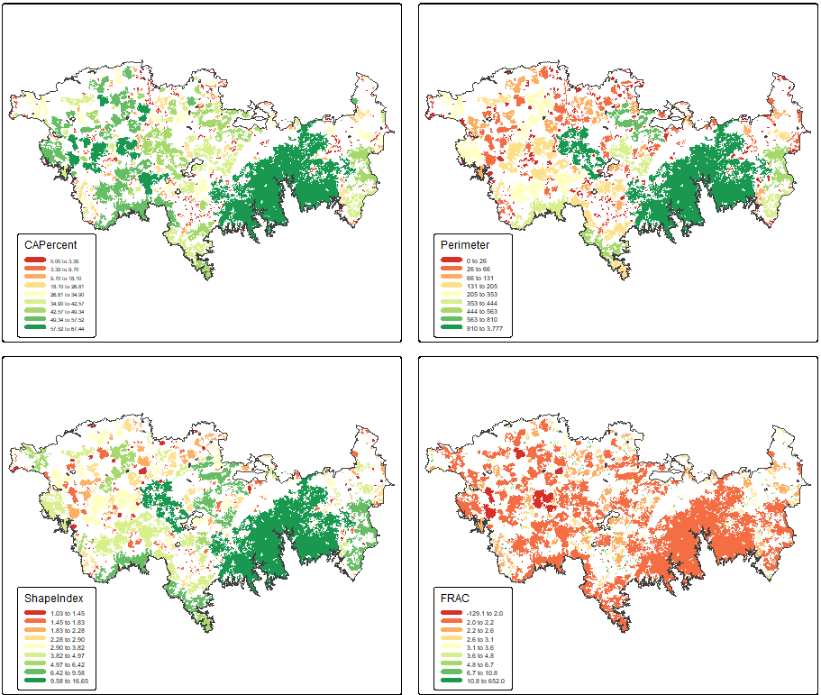
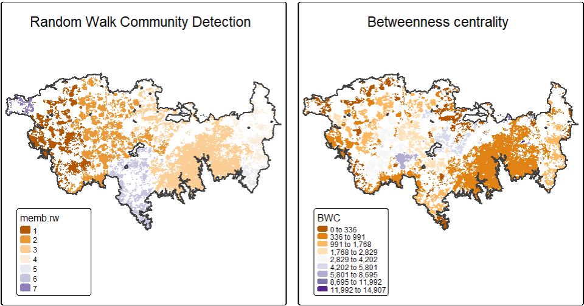
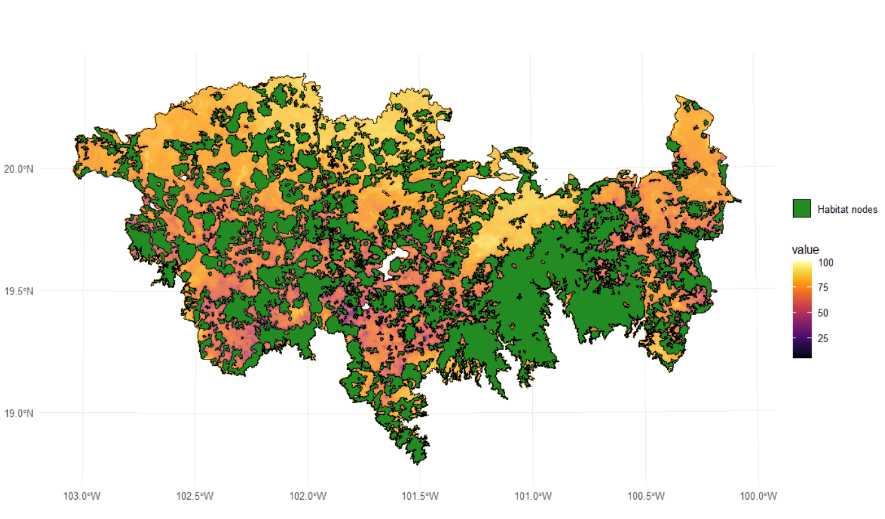
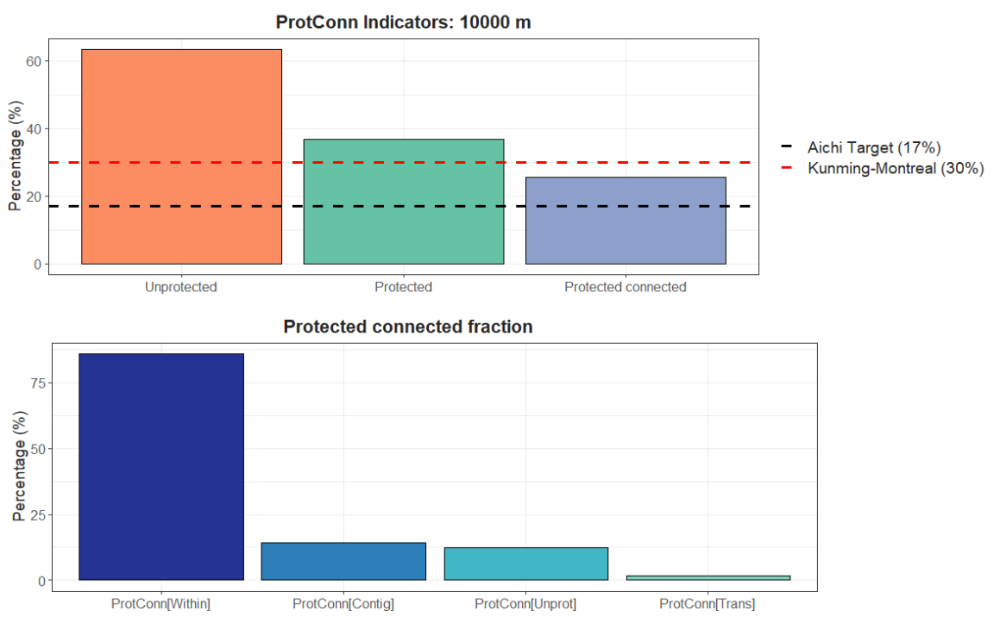
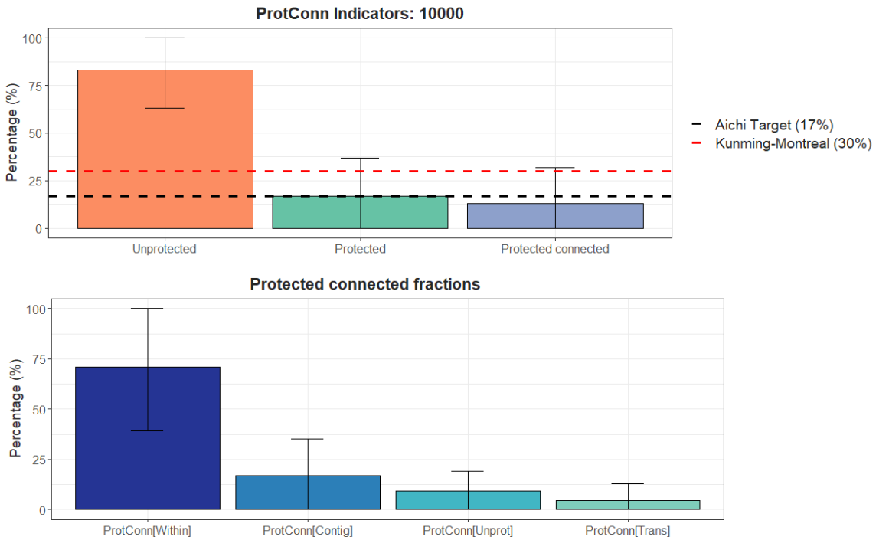

[](https://ci.appveyor.com/project/OscarGOGO/Makurhini)

[](https://lifecycle.r-lib.org/articles/stages.html#experimental)

<!-- README.md is generated from README.Rmd. Please edit that file -->

```{r, include = FALSE}
knitr::opts_chunk$set(
  collapse = TRUE,
  comment = "#>",
  fig.path = "man/figures/README-",
  out.width = "60%",
  message=FALSE, warning=FALSE
)
```

# Makurhini: An R package for comprehensive analysis of landscape fragmentation and connectivity.


## NEWS

Thank you for using Makurhini. **We have a new version Makurhini 3.0!**

1.  We have a new preprint: Godínez-Gómez, O., Correa-Ayram, C.,
    Goicolea, T., & Saura, S. (2025). **Makurhini: An R package for
    comprehensive analysis of landscape fragmentation and
    connectivity.** Research Square.
    <https://doi.org/10.21203/rs.3.rs-6398746/v1>

2.  The **MK_dPCIIC()** function now includes full support for the 
    three essential PC/IIC fractions, offering a much richer portrayal of
    landscape connectivity. These fractions capture intra-patch 
    connectivity (*intra*), direct inter-patch links (*direct*), and 
    stepwise connectivity through intermediate patches (*step*). 
    This enhancement provides users with a more nuanced and interpretable
    breakdown of how different components of the landscape contribute
    to overall connectivity (for details, see Saura, Bodin & Fortin, 
    2014; https://doi.org/10.1111/1365-2664.12179).

3.  We also introduced the new **MK_dPC_SAMC()** function, which brings powerful
    functionality for estimating overall landscape connectivity and the 
    importance of each habitat patch using the Probability of 
    Connectivity (PC) index. This function leverages a Spatial Absorbing 
    Markov Chain (SAMC) framework to model movement and settlement as 
    a random-walk dispersal process, enabling a realistic, spatially 
    explicit representation of how species traverse heterogeneous 
    landscapes (for details, see Fletcher et al., 
    2023; https://doi.org/10.1111/ele.13333).

4.  Two new functions have been added: **MK_dPCIIC_links and
    MK_Focal_nodes**. The first one is used to estimate the link
    importance for conservation and restoration. The second estimates
    the focal Integral Index of Connectivity (IIC~f~) or the focal
    Probability of Connectivity (PC~f~) under one or more distance
    thresholds. Furthermore, this function estimates the composite
    connectivity index (CCI~f~; for further details, please see
    Latorre-Cárdenas et al., 2023.
    <https://doi.org/10.3390/land12030631>).

## Overview

**Makurhini** *(Connect in Purépecha language)* is an R package for
calculating fragmentation and landscape connectivity indices used in
conservation planning. Makurhini provides a set of functions to identify
connectivity of protected areas networks and the importance of landscape
elements for maintaining connectivity. This package allows the
evaluation of scenarios under landscape connectivity changes and
presents an additional improvement, the inclusion of landscape
heterogeneity as a constraining factor for connectivity.

The network connectivity indices calculated in Makurhini package have
been previously published (e.g., Pascual-Hortal & Saura, 2006.
*Landscape ecology*, <https://doi.org/10.1007/s10980-006-0013-z>; Saura
& Pascual-Hortal, 2007. *Lanscape and urban planning*,
<https://doi.org/10.1016/j.landurbplan.2007.03.005>; Saura & Rubio,
2010. *Ecography*, <https://doi.org/10.1111/j.1600-0587.2009.05760.x>;
Saura et al., 2011. *Ecological indicators*,
<https://doi.org/10.1016/j.ecolind.2010.06.011>; Saura et al., 2017.
*Ecological indicators*,
<http://dx.doi.org/10.1016/j.ecolind.2016.12.047>; Saura et al., 2018.
*Biological conservation*,
<https://doi.org/10.1016/j.biocon.2017.12.020>), and it allows the
integration of efficient and useful workflow for landscape management
and monitoring of global conservation targets.

### Citing Makurhini package

We will soon publish a paper about this package. Until then, please use
the following **Preprint**:

Godínez-Gómez, O., Correa-Ayram, C., Goicolea, T., & Saura, S. (2025).
Makurhini: An R package for comprehensive analysis of landscape
fragmentation and connectivity. Research Square.
<https://doi.org/10.21203/rs.3.rs-6398746/v1>

## Installation

-   Depends: R (\> 4.0.0), igraph (\>= 1.2.6)
-   Pre-install
    [Rtools](https://cran.r-project.org/bin/windows/Rtools/).
-   Pre-install devtools (<code>install.packages("devtools")</code>) and
    remotes (<code>install.packages("remotes")</code>) packages.
-   **It is recommended to install the R igraph package (\>= 1.2.6)
    beforehand.**

You can install the released version of Makurhini from
[GitHub](https://github.com) with:

```{r echo=TRUE, eval=FALSE}
library(devtools)
library(remotes)
install_github("connectscape/Makurhini", dependencies = TRUE, upgrade = "never")
```

In case it does not appear in the list of packages, close the R session
and reopen.

**If the following error occurs during installation**:

```{r eval=FALSE}
Using github PAT
from envvar GITHUB_PAT Error: Failed to install 'unknown package' from
GitHub: HTTP error 401. Bad credentials

```

Then you can **try the following**:

```{r eval=FALSE}
Sys.getenv("GITHUB_PAT")
Sys.unsetenv("GITHUB_PAT")
```

## Makurhini on Linux

To install Makurhini on linux consider the following steps:

1)  Use the **Linux command line** to install the *unit* package:

    `sudo apt-get install -y libudunits2-dev`

2)  Use the **Linux command line** to install *gdal*:

    `sudo apt install libgdal-dev`

3)  Use the **Linux command line** to install *libfontconfig* and
    *libharfbuzz*:

    `sudo apt install libfontconfig1-dev`

    `sudo apt install libharfbuzz-dev libfribidi-dev`

4)  You can now install the *devtools* and *remotes* packages, and the
    *terra*, *raster* and *sf* packages directly in your **R or
    RStudio**.

    `install.packages(c('remotes', 'devtools', 'terra', 'raster', 'sf'))`

5)  Use the **Linux command line** to install *igraph*:

    `sudo apt-get install libnlopt-dev`

    `sudo apt-get install r-cran-igraph`

6)  You can now install the *gdistance*, *graph4lg* and *ggpubr*
    packages directly in your **R or RStudio.**

    `install.packages(c('gdistance', 'graph4lg', 'ggpubr'))`

7)  Now you can install Makurhini directly in your **R or RStudio.**

```{r echo=TRUE, eval=FALSE}
library(devtools)
library(remotes)
install_github("connectscape/Makurhini", dependencies = TRUE, upgrade = "never")
```

Note that the installation of Makurhini on Linux depends on your version
of operating system and that you manage to install the packages that
Makurhini depends on.

## Summary of main *Makurhini* functions

```{r echo=FALSE}
library(formattable)
functions_MK <- data.frame(Function = c("MK_Fragmentation", "distancefile", "MK_RMCentrality", "MK_BCentrality",  "MK_dPCIIC", "MK_dECA", "MK_ProtConn", "MK_ProtConnMult", "MK_ProtConn_raster", "MK_Connect_grid",
"MK_dPCIIC_links", "MK_Focal_nodes", "test_metric_distance"), Purpose = c("Calculate patch and landscape statistics (e.g., mean size patches, edge density, core area percent, shape index, fractal dimension index, effective mesh size).", "Get a table or matrix with the distances between pairs of nodes. Two Euclidean distances ('centroid' and 'edge') and two cost distances that consider the landscape heterogeneity ('least-cost' and 'commute-time, this last is analogous to the resistance distance of circuitscape, see ’gdistance’ package).", "Estimate centrality measures under one or several dispersal distances (e.g., betweenness centrality, node memberships, modularity). It uses the 'distancefile ()' to calculate the distances of the nodes so they can be calculated using Euclidean or cost distances that consider the landscape heterogeneity.", "Calculate the BC, BCIIC and BCPC indexes under one or several distance thresholds using the command line of CONEFOR. It uses the 'distancefile ()' to calculate the distances of the nodes so they can be calculated using Euclidean or cost distances that consider the landscape heterogeneity", "Calculate the integral index of connectivity (IIC) and probability of connectivity (PC) indices under one or several dispersal distances. It computes overall and index fractions (dPC or dIIC, intra, flux and connector) and the effect of restauration in the landscape connectivity when adding new nodes (restoration scenarios). It uses the 'distancefile()'.", "Estimate the Equivalent Connected Area (ECA) and compare the relative change in ECA (dECA) between time periods using one or several dispersal distances. It uses the 'distancefile()'.", "Estimate the Protected Connected (ProtConn) indicator and fractions for one region using one or several dispersal distances and transboundary buffer areas (e.g., ProtConn, ProtUnconn, RelConn, ProtConn[design], ProtConn[bound], ProtConn[Prot], ProtConn[Within], ProtConn[Contig], ProtConn[Trans], ProtConn[Unprot]). It uses the 'distancefile(). This function estimates what we call the ProtConn delta (dProtConn) which estimates the contribution of each protected area to connectivity in the region (ProtConn value)", "Estimate the ProtConn indicator and fractions for multiple regions. It uses the 'distancefile()'.", "Estimate Protected Connected (ProtConn) indicator and fractions for one region using raster inputs (nodes and region). It uses the 'distancefile()'.", "Compute the ProtConn indicator and fractions, PC or IIC overall connectivity metrics (ECA) in a regular grid. It uses the 'distancefile()'.", "Estimate the link importance for conservation and restoration. It calculates the contribution of each individual link to maintain (mode: link removal) or improve (mode: link change) the overall connectivity.", "Estimate the focal Integral Index of Connectivity or the focal Probability of Connectivity  and the Composite Connectivity Index under one or more distance thresholds.", "Compare ECA or ProtConn connectivity metrics using one or up to four types of distances, computed in the 'distancefile()' function, and multiple dispersion distances."))

formattable(functions_MK,  align =c("l","l"), list(`Function` = formatter(
              "span", style = ~ style(font.style = "italic"))))

```

## Examples

-   [Fragmentation statistics]

-   [Centrality measures] (e.g., betweenness centrality, node
    memberships, and modularity)

-   [Probability of connectivity (PC) and fractions (Intra, Flux and
    Connector)](#probability-of-connectivity-pc-and-fractions-intra-flux-and-connector)

-   [Equivalent Connectivity Area
    (ECA)](#equivalent-connectivity-area-eca)

-   [Protected Connected Land
    (ProtConn)](#protected-connected-land-protconn)

```{r echo=FALSE, warning=FALSE, message=FALSE}
library(Makurhini)
library(sf)
library(raster)
library(terra)
library(tmap)
library(mapview)
library(classInt)
library(ggplot2)
library(rmapshaper)
setwd(getwd())
```

### Fragmentation statistics

*'MK_Fragmentation()'* estimates fragmentation statistics at the
landscape and patch/node level.

In this example, the `MK_Fragmentation()` function was applied to
estimate fragmentation indices on 404 remaining habitat fragments, which
were modeled for 40 species of non-flying mammals of the Trans-Mexican
Volcanic System (TMVS) by Correa Ayram et al., (2017).

```{r }
data("habitat_nodes", package = "Makurhini")
nrow(habitat_nodes) # Number of nodes
```

To define the edge of the nodes we can use, for example, a distance of
500 m from the limit of the nodes.


```{r }
Fragmentation_test <- MK_Fragmentation(nodes = habitat_nodes, edge_distance = 500,
                                       plot = TRUE, min_node_area = 100, 
                                       landscape_area = NULL, area_unit = "km2", 
                                       perimeter_unit = "km")

```

-   The results are presented as a list, the first result is called
    *"Summary landscape metrics (Viewer Panel)"* and it has
    fragmentation statistics at landscape level.

```{r }
class(Fragmentation_test)
names(Fragmentation_test)
Fragmentation_test$`Summary landscape metrics (Viewer Panel)`
```

-   The second output *"Patch statistics shapefile"* is a shapefile with
    patch level fragmentation statistics that can be saved using
    write_sf() from *'sf'* package
    (<https://cran.r-project.org/web/packages/sf/index.html>).

```{r }
head(Fragmentation_test[[2]])
```

```{r eval = FALSE, echo=FALSE, out.width = "100%", message=FALSE, warning=FALSE}
library(classInt)
tmap_mode("plot")
c <-9
CAP <- tm_shape(Fragmentation_test[[2]]) + 
  tm_fill("CAPercent", 
          fill.scale = tm_scale(breaks = classIntervals(Fragmentation_test[[2]]$CAPercent, c, "jenks")[[2]],
                                values = RColorBrewer::brewer.pal(c, "RdYlGn")))+ 
  tm_shape(TMVS) + tm_borders(lwd = 1.5)+ tm_layout(legend.width = 4.3, 
                                                    legend.height = 5.6,
                                                    legend.position = c(-0.01, 0.3),
                                                    legend.text.size = 1,
                                                    legend.title.size = 0.7) 
  #tm_title("Core Area %", position = c("center", "top"))+

Per <- tm_shape(Fragmentation_test[[2]]) + 
  tm_fill("Perimeter", 
          fill.scale = tm_scale(breaks = classIntervals(Fragmentation_test[[2]]$Perimeter, c, "jenks")[[2]],
                                values = RColorBrewer::brewer.pal(c, "RdYlGn")))+ 
  tm_shape(TMVS) + tm_borders(lwd = 1.5)+ tm_layout(legend.width = 4.3, 
                                                    legend.height = 5.6,
                                                    legend.position = c(-0.01, 0.3),
                                                    legend.text.size = 1,
                                                    legend.title.size = 0.7) 

SH <- tm_shape(Fragmentation_test[[2]]) + 
  tm_fill("ShapeIndex", 
          fill.scale = tm_scale(breaks = classIntervals(Fragmentation_test[[2]]$ShapeIndex, c, "jenks")[[2]],
                                values = RColorBrewer::brewer.pal(c, "RdYlGn")))+ 
  tm_shape(TMVS) + tm_borders(lwd = 1.5)+ tm_layout(legend.width = 4.3, 
                                                    legend.height = 5.6,
                                                    legend.position = c(-0.01, 0.3),
                                                    legend.text.size = 1,
                                                    legend.title.size = 0.7) 

Frac <- tm_shape(Fragmentation_test[[2]]) + 
  tm_fill("FRAC", 
          fill.scale = tm_scale(breaks = classIntervals(Fragmentation_test[[2]]$FRAC, c, "quantile")[[2]],
                                values = RColorBrewer::brewer.pal(c, "RdYlGn"),
                                midpoint = NA))+ 
  tm_shape(TMVS) + tm_borders(lwd = 1.5)+ tm_layout(legend.width = 4.3, 
                                                    legend.height = 5.6,
                                                    legend.position = c(-0.01, 0.3),
                                                    legend.text.size = 1,
                                                    legend.title.size = 0.7) 

tmap_arrange(CAP, Per, SH, Frac)

```



We can make a loop where we explore different edge depths. In the
following example, We will explore 10 edge depths (*edge_distance
argument*): 100, 200, 300, 400, 500, 600, 700, 800, 900 and 1000 meters.
We will apply the *'MK_Fragmentation()'* function using the previous
distances and then, we will extract the core area percentage and edge
percentage statistics. Finally, we will plot the average of the patch
core area percentage and edge percentage (% core area + % edge = 100%).

```{r echo=TRUE}
library(purrr)
Fragmentation_test.2 <- map_dfr(seq(100, 1000, 100), function(x){
  x.1 <- MK_Fragmentation(nodes = habitat_nodes, 
                          edge_distance = x, plot = FALSE)[[2]]
  CA <- mean(x.1$CAPercent)
  Edge <- mean(x.1$EdgePercent)
  x.2 <- rbind(data.frame('Edge distance' = x, Type = "Core Area", Percentage = CA),
                     data.frame('Edge distance' = x, Type = "Edge", Percentage = Edge))
  return(x.2)
})

```

```{r echo=FALSE}
library(ggplot2)
ggplot(Fragmentation_test.2, aes(x = Edge.distance, y = Percentage, group = Type)) +
  geom_line(aes(color = Type))+
  geom_point(aes(color = Type))+ ylim(0,100)+
  scale_x_continuous("Edge depth distance (m)", 
                     labels = as.character(Fragmentation_test.2$Edge.distance), breaks = Fragmentation_test.2$Edge.distance)+
  scale_color_brewer(palette="Dark2")+
  theme_classic()
```

The mean core area percentage (the mean node/patch area that exhibits
the least possible edge effect) for all patches is observed to decline
by over 60% when an edge depth distance of 1 km is considered.

| Edge depth distance (m) | Core Area (%) |
|-------------------------|:-------------:|
| 100                     |    65.76%     |
| 500                     |    12.86%     |
| 1000                    |     3.63%     |

### Centrality measures

In this example, we continue to use the 404 remaining habitat fragments
to estimate centrality indices using the `MK_RMCentrality()` function.

```{r }
centrality_test <- MK_RMCentrality(nodes = habitat_nodes,
                                 distance = list(type = "centroid"),
                                 distance_thresholds = 10000,
                                 probability = 0.5,
                                 write = NULL)
head(centrality_test)
```

Examples:



```{r eval = FALSE, echo=FALSE, out.width = "100%"}
cluster.randomwalk <- tm_shape(centrality_test) + 
  tm_fill("memb.rw", 
          fill.scale = tm_scale_discrete(ticks =  1:length(unique(centrality_test$memb.rw)), 
                                         values = RColorBrewer::brewer.pal(length(unique(centrality_test$memb.rw)), "PuOr"))) + 
  tm_shape(TMVS) + tm_borders(lwd = 2)+  
  tm_title("Random Walk Community Detection", position = c("center", "top"))+
  tm_layout(legend.width = 8.5, legend.height = 10,
            legend.position = c(0.01, 0.3)) 

BWC <- tm_shape(centrality_test) + 
  tm_fill("BWC", 
          fill.scale = tm_scale(breaks = classIntervals(centrality_test$BWC, 9, "jenks")[[2]], 
                                values = RColorBrewer::brewer.pal(9, "PuOr"))) + 
  tm_shape(TMVS) + tm_borders(lwd = 2)+ 
  tm_title("Betweenness centrality", position = c("center", "top"))+
  tm_layout(legend.width = 8.5, legend.height = 10,
            legend.position = c(0.01, 0.3))
  
tmap_arrange(cluster.randomwalk, BWC, ncol = 2)
```

**Moreover, you can change distance using the distance
(**<code>**?distancefile**</code>**) argument:**

**Euclidean distances:**

-   distance = list(type= "centroid")
-   distance = list(type= "edge")

**Least cost distances:**

-   distance = list(type= "least-cost", resistance = resistance raster)
-   distance = list(type= "commute-time", resistance = resistance
    raster)

### Probability of connectivity (PC) and fractions (Intra, Flux and Connector) {#probability of connectivity (PC) and fractions (Intra, Flux and Connector)}

In this example, the `MK_dPCIIC()` function was applied to estimate the
connectivity of the 404 habitat fragments. In addition, we used a raster
of dispersion resistance in the landscape that was estimated at a
100-meter resolution using a spatial human footprint index, land use
intensity, time of human landscape intervention, biophysical
vulnerability, fragmentation, and habitat loss (Correa Ayram et al.,
2017). The raster was aggregated by a factor of 5 to change its original
resolution from 100m to 500m. To represent different dispersal
capacities of multiple species we considered the following median
(associated to a probability of 0.5) distance thresholds: 250, 1500,
3000, and 10,000 meters. These four distances group the 40 species
according to their dispersal distance requirements.

```{r message=FALSE, warning=FALSE}
#Habitat nodes
data("habitat_nodes", package = "Makurhini")
nrow(habitat_nodes)

#Study area
data("TMVS", package = "Makurhini")

#Resistance
data("resistance_matrix", package = "Makurhini")

```

```{r eval = FALSE, message=FALSE, warning=FALSE, out.width = "100%"}
raster_map <- as(resistance_matrix, "SpatialPixelsDataFrame")
raster_map <- as.data.frame(raster_map)
colnames(raster_map) <- c("value", "x", "y")
ggplot() +  
  geom_tile(data = raster_map, aes(x = x, y = y, fill = value), alpha = 0.8) + 
  geom_sf(data = TMVS, aes(color = "Study area"), fill = NA, color = "black") +
  geom_sf(data = habitat_nodes, aes(color = "Habitat nodes"), fill = "forestgreen", linewidth = 0.5) +
  scale_fill_gradientn(colors = c("#000004FF", "#1B0C42FF", "#4B0C6BFF", "#781C6DFF",
                                  "#A52C60FF", "#CF4446FF", "#ED6925FF", "#FB9A06FF",
                                  "#F7D03CFF", "#FCFFA4FF"))+
  scale_color_manual(name = "", values = "black")+
  theme_minimal() +
  theme(axis.title.x = element_blank(),
        axis.title.y = element_blank())
```



```{r eval=FALSE, message=FALSE, warning=FALSE}
PC_example <- MK_dPCIIC(nodes = habitat_nodes,
                        attribute = NULL,
                        distance = list(type = "least-cost",
                                        resistance = resistance_matrix),
                        parallel = NULL,
                        metric = "PC",
                        probability = 0.5,
                        distance_thresholds = c(250, 1500, 3000, 10000))
```

```{r eval=TRUE, message=FALSE, warning=FALSE, echo=FALSE}
PC_example <- readRDS("G:/Mi unidad/Makurhini_package/TEST_Folder/PC_example_2.rds")
```

We obtain a `list` object where each element is a result for each
distance threshold.

```{r eval=TRUE, message=FALSE, warning=FALSE}
class(PC_example)

names(PC_example)

head(PC_example$d10000)
```

Each element of the list is a vector type object that can be exported
using the sf functions and in its vector formats (e.g., shp, gpkg) using
the sf package (Pebesma et al., 2024), for example:

```{r eval=FALSE, message=FALSE, warning=FALSE}
write_sf(PC_example$d10000, “.../dPC_d0000.shp”)
```

We can use, for example, ggplot2 to map the results:

```{r message=FALSE, warning=FALSE, out.width = "90%"}
library(classInt)
library(dplyr)
library(ggplot2)

PC <- PC_example$d10000 #Result 10 km

# Calcular los intervalos de Jenks para strength
breaks <- classInt::classIntervals(PC$dPC, n = 9, style = "jenks")

# Crear una nueva variable categórica con los intervalos
PC <- PC %>%
  mutate(dPC_q = cut(dPC,
                          breaks = breaks$brks,
                          include.lowest = TRUE,
                          dig.lab = 5))  

# Graficar en ggplot2 usando las clases Jenks
ggplot() +  
  geom_sf(data = TMVS, color = "black") +
  geom_sf(data = PC, aes(fill = dPC_q), color = "black", size = 0.1) +
  scale_fill_brewer(palette = "RdYlGn", direction = 1, name = "dPC (jenks)") +
  theme_minimal() +
  labs(
    title = "dPC Least-cost distance",
    fill = "dPC"
  ) +
  theme(
    legend.position = "right",
    plot.title = element_text(hjust = 0.5)
  )

```


### Focal probability of connectivity (*PC~f~*)

The function `MK_focal_nodes()` enables the calculation of the focal
Integral Index of Connectivity (IICf) or the focal Probability of
Connectivity (PCf​) under one or more distance thresholds. Furthermore,
this function estimates the composite connectivity index (CCIf​; for
further details, please see Latorre-Cárdenas et al., 2023). In this
example, we apply the `MK_focal_nodes()` to the 404 habitat patches.

```{r eval=FALSE}
focal_example <- MK_Focal_nodes(nodes = habitat_nodes,
                       id = "Id",
                       attribute = NULL,
                       raster_attribute = NULL,
                       fun_attribute = NULL,
                       distance = list(type = "least-cost",
                                       resistance = resistance_matrix),
                       metric = "PC",
                       probability = 0.5,
                       parallel = 4,
                       distance_thresholds = 10000,
                       search_buffer = 20000,
                       intern = FALSE)
head(focal_example)
```

```{r echo=FALSE, eval=TRUE}
focal_example <- readRDS("G:/Mi unidad/Makurhini_package/TEST_Folder/PCfocal.rds")

head(focal_example)
```

```{r message=FALSE, warning=FALSE, out.width = "90%"}
# Calcular los intervalos de Jenks para strength
breaks <- classInt::classIntervals(focal_example$IComp, n = 9, style = "jenks")

# Crear una nueva variable categórica con los intervalos
focal_example <- focal_example %>%
  mutate(IComp_q = cut(IComp,
                     breaks = breaks$brks,
                     include.lowest = TRUE,
                     dig.lab = 5))  

# Graficar en ggplot2 usando las clases Jenks
ggplot() +  
  geom_sf(data = TMVS, color = "black") +
  geom_sf(data = focal_example, aes(fill = IComp_q), color = "black", size = 0.1) +
  scale_fill_brewer(palette = "RdYlGn", direction = 1, name = "IComp (jenks)") +
  theme_minimal() +
  labs(
    title = "Composite connectivity index (IComp)",
    fill = "IComp"
  ) +
  theme(
    legend.position = "right",
    plot.title = element_text(hjust = 0.5)
  )

```

### Equivalent Connectivity Area (ECA) {#equivalent-connectivity-area-eca}

Example in the Biosphere Reserve Mariposa Monarca, Mexico, with
old-growth vegetation fragments of four times (?list_forest_patches).

```{r eval=TRUE}
data("list_forest_patches", package = "Makurhini")
data("study_area", package = "Makurhini")
class(list_forest_patches)

Max_attribute <- unit_convert(st_area(study_area), "m2", "ha")
```

```{r eval=TRUE, message=FALSE, warning=FALSE}
dECA_test <- MK_dECA(nodes= list_forest_patches, attribute = NULL, area_unit = "ha",
                  distance = list(type= "centroid"), metric = "PC",
                  probability = 0.05, distance_thresholds = 5000,
                  LA = Max_attribute, plot= c("1993", "2003", "2007", "2011"), intern = FALSE)
```

ECA table:

{width="504"}

Another way to analyze the ECA (and ProtConn indicator) is by using the
*'MK_Connect_grid()'* that estimates the index values on a grid. An
example of its application is the following, on the Andean-Amazon
Piedmont. The analysis was performed using a grid of hexagons each with
an area of 10,000 ha and a forest/non-forest map to measure changes in
Andean-Amazon connectivity.


### Protected Connected Land (ProtConn) {#protected-connected-land-protconn}

In this example, we assess the connectivity of Colombia's protected
areas network in 33 ecoregions of great importance to the country using
the Protected Connected Indicator (ProtConn). Particularly, we have
1,530 polygons of protected areas. The spatial information utilized in
this example is derived from the connectivity assessment study of
protected areas in the Andean Amazon region, as conducted by Castillo et
al., (2020). In order to estimate the ProtConn index, we employ the
`MK_ProtConn()` and `MK_ProtConn_mult()` functions. In this example, we
will utilize an organism median dispersal distance threshold of 10 km, a
connection probability pij = 0.5, and a transboundary PA search radius
of 50 km (for further details, please refer to Castillo et al., 2020;
Saura et al., 2017). We used Euclidean distances, particularly the
distances between edges to establish the connections between nodes
(PAs).

```{r echo=TRUE, eval=TRUE, message=FALSE, warning=FALSE}
#Protected areas
load(system.file("extdata", "Protected_areas.rda",
                 package = "Makurhini", mustWork = TRUE))
nrow(Protected_areas)

```

```{r message=FALSE, warning=FALSE}
#Ecoregions
data("Ecoregions", package = "Makurhini")
nrow(Ecoregions)
```

```{r warning=FALSE, message=FALSE, echo=FALSE, out.width = "90%"}
mask_ecoregions <- ms_dissolve(Ecoregions)
PAs_national <- ms_clip(Protected_areas, mask_ecoregions)
PAs_transnational <- ms_erase(Protected_areas, mask_ecoregions)
PAs_transnational$Type <- "PAs in neighboring countries"
PAs_subnational <- PAs_national[PAs_national$ESCALA_2 == "Subnacional",]
PAs_subnational$Type <- "Subnational PAs"
PAs_national <- PAs_national[PAs_national$ESCALA_2 == "Nacional",]
PAs_national$Type <- "National PAs"
PAs <- rbind(PAs_national, PAs_subnational, PAs_transnational)
PAs$Type <- factor(PAs$Type, levels = c("National PAs", "Subnational PAs", "PAs in neighboring countries"))

ggplot() +
  geom_sf(data = Ecoregions, aes(fill = "Ecoregions"), color = "black") +
  geom_sf(data = PAs, aes(fill=Type), color = NA) +
  scale_fill_manual(name = "Type", values = c("#1DAB80", "#FF00C5", "#E06936", "#8D8BBE"))+
  theme_minimal() 
```

#### MK_ProtConn()

This function calculates the Protected Connected indicator (ProtConn)
for a region, its fractions and the importance (contribution) of each
protected area to maintain connectivity in the region under one or more
distance thresholds.

```{r eval=TRUE, message=FALSE, warning=FALSE}
#Select first ecoregion
Ecoregion_1 <- Ecoregions[1,]

#keep = 0.6 simplify the geometry and reduce the number of vertices
ProtConn_1 <- MK_ProtConn(nodes = Protected_areas, region = Ecoregion_1, 
                          area_unit = "ha", 
                          distance = list(type= "edge", keep = 0.6),
                          distance_thresholds = 10000, probability = 0.5,
                          transboundary = 50000, plot = TRUE, 
                          delta = TRUE, intern = FALSE)

```

A dynamic table is generated, displaying the ProtConn values and their
fractions. Additionally, a graph is produced, illustrating the ProtConn
values and comparing them with the percentage of protected and connected
area recommended for a region in the Aichi and Kumming-Montreal targets.

```{r}
class(ProtConn_1)
names(ProtConn_1)
```

```{r eval= TRUE, message=FALSE, warning=FALSE}
ProtConn_1$`Protected Connected (Viewer Panel)`
```

```{r eval= FALSE, message=FALSE, warning=FALSE, out.width = "100%"}
ProtConn_1$`ProtConn Plot`
```



ProtConn delta or the higher contribution to ProtConn value in the
ecoregion (grey polygon):

```{r message=FALSE, warning=FALSE, out.width = "90%"}
ggplot()+
  geom_sf(data = Ecoregion_1, col = "black")+
  geom_sf(data = ProtConn_1$ProtConn_Delta, 
          aes(fill = cut(dProtConn, breaks = classIntervals(ProtConn_1$ProtConn_Delta$dProtConn, 7, "jenks")[[2]])), color = NA)+
  scale_fill_brewer(type = "qual",
                    palette = "YlOrRd",
                    name = "dProtConn PAs",
                    na.translate = FALSE)+
  theme_minimal() +
  theme(
    legend.position.inside = c(0.1,0.21),
    legend.key.height = unit(0.4, "cm"),
    legend.key.width = unit(0.5, "cm")
  )

```

#### MK_ProtConnMult()

In order to facilitate the estimation of the ProtConn index for a
variety of geographical regions, the MK_ProtConnMult function has been
incorporated into Makurhini, which enables the estimation of the
ProtConn indicator and fractions for different regions.

```{r eval=FALSE}
ProtConn_2 <- MK_ProtConnMult(nodes = Protected_areas, 
                              region = Ecoregions,
                              area_unit = "ha",
                              distance = list(type= "edge"),
                              distance_thresholds = 10000,
                              probability = 0.5, transboundary = 50000,
                              plot = TRUE, parallel = 4)
```

```{r echo=FALSE}
ProtConn_2 <- readRDS("G:/Mi unidad/Makurhini_package/TEST_Folder/ProtConn_1b.rds")
```

A dynamic table and vector (sf class) are generated, displaying the
ProtConn values and their fractions. Additionally, a graph is produced,
illustrating the ProtConn values and comparing them with the percentage
of protected and connected area recommended for a region in the Aichi
and Kumming-Montreal targets.

```{r}
class(ProtConn_2)
names(ProtConn_2)
```

Table:

```{r eval=TRUE}
ProtConn_2$ProtConn_10000$ProtConn_overall10000
```

Plot showing the mean and standard deviation values:

```{r eval=FALSE}
ProtConn_2$ProtConn_10000$`ProtConn Plot`
```



Vector file of class sf:

```{r}
head(ProtConn_2$ProtConn_10000$ProtConn_10000)
```

Visualize using ggplot2:

```{r eval=TRUE, message=FALSE, warning=FALSE, echo= FALSE}
interv <- c(0.0701, 1.9375, 4.2690, 6.6786, 10.7244, 17.8158, 25.6303, 41.8570, 45.4735, 97.7425)
```

```{r eval=FALSE, message=FALSE, warning=FALSE, echo=TRUE}
#We can use some package to get intervals for example classInt R Packge:
#library(classInt)
#interv <- classIntervals(ProtConn_2$ProtConn_10000$ProtConn_10000$ProtConn, 9, "jenks")[[2]]
```

```{r message=FALSE, warning=FALSE, out.width = "90%"}
ggplot()+
  geom_sf(data = Ecoregions)+
  geom_sf(data = ProtConn_2$ProtConn_10000$ProtConn_10000, 
          aes(fill = cut(ProtConn, breaks = interv)), color = NA)+
  scale_fill_brewer(type = "qual",
                    palette = "RdYlGn",
                    name = "ProtConn",
                    na.translate = FALSE)+
  theme_minimal() +
  theme(
    legend.position.inside = c(0.1,0.21),
    legend.key.height = unit(0.4, "cm"),
    legend.key.width = unit(0.5, "cm")
  )
```
