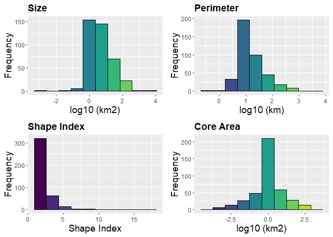

[](https://ci.appveyor.com/project/OscarGOGO/Makurhini)

<!-- README.md is generated from README.Rmd. Please edit that file -->

# Makurhini


The goal of Makurhini is to provide a set of functions to estimate
landscape fragmentation and connectivity metrics

## Installation

  - Pre-install
    [Rtools](https://cran.r-project.org/bin/windows/Rtools/).
  - Pre-install devtools package
    (<code>install.packages(“devtools”)</code>)

You can install the released version of Makurhini from
[GitHub](https://github.com) with:

``` r
library(devtools)
install_github("OscarGOGO/Makurhini", dependencies = TRUE, upgrade = "never")
```

In case it does not appear in the list of packages, close the R session
and reopen.

## Example

This is a basic example which shows you how to solve some common
problems:

  - Protected Connected Land (<i>ProtConn</i>)
  - Equivalent Connectivity (<i>EC</i>)
  - Integral index of connectivity (<i>IIC</i>) and fractions
    (<i>dIICintra, dIICflux and dIICconnector</i>)
  - Probability of connectivity (<i>PC</i>) and fractions (<i>dPCintra,
    dPCflux and dPCconnector</i>)
  - Centrality measures (e.g., betweenness centrality, node memberships,
    and modularity)

### Protected Connected Land (ProtConn)

Protected areas:

``` r
data("Protected_areas", package = "Makurhini")
data("regions", package = "Makurhini")
region <- regions[1,]
```


``` r
test <- MK_ProtConn(nodes = Protected_areas, region = region,
                    attribute = "Intersected area", area_unit = "ha",
                    distance = list(type= "centroid"),
                    distance_thresholds = 10000,
                    probability = 0.5, transboundary = 50000,
                    LA = NULL, plot = TRUE, dPC = FALSE,
                    write = NULL, SAGA = FALSE, intern = FALSE)
test$`Protected Connected (Viewer Panel)`
```

<table class="table table-condensed">

<thead>

<tr>

<th style="text-align:left;">

Index

</th>

<th style="text-align:center;">

Value

</th>

<th style="text-align:left;">

ProtConn indicator

</th>

<th style="text-align:center;">

Percentage

</th>

</tr>

</thead>

<tbody>

<tr>

<td style="text-align:left;">

<span style="color: #636363; font-weight: bold">EC(PC)</span>

</td>

<td style="text-align:center;">

130189.18

</td>

<td style="text-align:left;">

<span style="color: #636363; font-weight: bold">Unprotected </span>

</td>

<td style="text-align:center;">

<span style="display: block; padding: 0 4px; border-radius: 4px; background-color: #ffa90d">92.540</span>

</td>

</tr>

<tr>

<td style="text-align:left;">

<span style="color: #636363; font-weight: bold">PC </span>

</td>

<td style="text-align:center;">

1.2324e-03

</td>

<td style="text-align:left;">

<span style="color: #636363; font-weight: bold">Prot </span>

</td>

<td style="text-align:center;">

<span style="display: block; padding: 0 4px; border-radius: 4px; background-color: #fff8eb">7.460</span>

</td>

</tr>

<tr>

<td style="text-align:left;">

<span style="color: #636363; font-weight: bold"> </span>

</td>

<td style="text-align:center;">

</td>

<td style="text-align:left;">

<span style="color: #636363; font-weight: bold">ProtConn </span>

</td>

<td style="text-align:center;">

<span style="display: block; padding: 0 4px; border-radius: 4px; background-color: #fffbf5">3.511</span>

</td>

</tr>

<tr>

<td style="text-align:left;">

<span style="color: #636363; font-weight: bold"> </span>

</td>

<td style="text-align:center;">

</td>

<td style="text-align:left;">

<span style="color: #636363; font-weight: bold">ProtUnconn </span>

</td>

<td style="text-align:center;">

<span style="display: block; padding: 0 4px; border-radius: 4px; background-color: #fffbf4">3.950</span>

</td>

</tr>

<tr>

<td style="text-align:left;">

<span style="color: #636363; font-weight: bold"> </span>

</td>

<td style="text-align:center;">

</td>

<td style="text-align:left;">

<span style="color: #636363; font-weight: bold">RelConn </span>

</td>

<td style="text-align:center;">

<span style="display: block; padding: 0 4px; border-radius: 4px; background-color: #ffd383">47.058</span>

</td>

</tr>

<tr>

<td style="text-align:left;">

<span style="color: #636363; font-weight: bold"> </span>

</td>

<td style="text-align:center;">

</td>

<td style="text-align:left;">

<span style="color: #636363; font-weight: bold">ProConn\_design </span>

</td>

<td style="text-align:center;">

<span style="display: block; padding: 0 4px; border-radius: 4px; background-color: #fffbf4">3.950</span>

</td>

</tr>

<tr>

<td style="text-align:left;">

<span style="color: #636363; font-weight: bold"> </span>

</td>

<td style="text-align:center;">

</td>

<td style="text-align:left;">

<span style="color: #636363; font-weight: bold">ProConn\_Bound </span>

</td>

<td style="text-align:center;">

<span style="display: block; padding: 0 4px; border-radius: 4px; background-color: #fffbf5">3.511</span>

</td>

</tr>

<tr>

<td style="text-align:left;">

<span style="color: #636363; font-weight: bold"> </span>

</td>

<td style="text-align:center;">

</td>

<td style="text-align:left;">

<span style="color: #636363; font-weight: bold">ProtConn\_Prot </span>

</td>

<td style="text-align:center;">

<span style="display: block; padding: 0 4px; border-radius: 4px; background-color: #ffa500">97.512</span>

</td>

</tr>

<tr>

<td style="text-align:left;">

<span style="color: #636363; font-weight: bold"> </span>

</td>

<td style="text-align:center;">

</td>

<td style="text-align:left;">

<span style="color: #636363; font-weight: bold">ProtConn\_Trans </span>

</td>

<td style="text-align:center;">

<span style="display: block; padding: 0 4px; border-radius: 4px; background-color: #ffffff">0.000</span>

</td>

</tr>

<tr>

<td style="text-align:left;">

<span style="color: #636363; font-weight: bold"> </span>

</td>

<td style="text-align:center;">

</td>

<td style="text-align:left;">

<span style="color: #636363; font-weight: bold">ProtConn\_Unprot </span>

</td>

<td style="text-align:center;">

<span style="display: block; padding: 0 4px; border-radius: 4px; background-color: #fffcf8">2.488</span>

</td>

</tr>

<tr>

<td style="text-align:left;">

<span style="color: #636363; font-weight: bold"> </span>

</td>

<td style="text-align:center;">

</td>

<td style="text-align:left;">

<span style="color: #636363; font-weight: bold">ProtConn\_Within </span>

</td>

<td style="text-align:center;">

<span style="display: block; padding: 0 4px; border-radius: 4px; background-color: #ffa707">94.784</span>

</td>

</tr>

<tr>

<td style="text-align:left;">

<span style="color: #636363; font-weight: bold"> </span>

</td>

<td style="text-align:center;">

</td>

<td style="text-align:left;">

<span style="color: #636363; font-weight: bold">ProtConn\_Contig </span>

</td>

<td style="text-align:center;">

<span style="display: block; padding: 0 4px; border-radius: 4px; background-color: #fffcf7">2.728</span>

</td>

</tr>

<tr>

<td style="text-align:left;">

<span style="color: #636363; font-weight: bold"> </span>

</td>

<td style="text-align:center;">

</td>

<td style="text-align:left;">

<span style="color: #636363; font-weight: bold">ProtConn\_Within\_land</span>

</td>

<td style="text-align:center;">

<span style="display: block; padding: 0 4px; border-radius: 4px; background-color: #fffbf6">3.327</span>

</td>

</tr>

<tr>

<td style="text-align:left;">

<span style="color: #636363; font-weight: bold"> </span>

</td>

<td style="text-align:center;">

</td>

<td style="text-align:left;">

<span style="color: #636363; font-weight: bold">ProtConn\_Contig\_land</span>

</td>

<td style="text-align:center;">

<span style="display: block; padding: 0 4px; border-radius: 4px; background-color: #fffefe">0.096</span>

</td>

</tr>

<tr>

<td style="text-align:left;">

<span style="color: #636363; font-weight: bold"> </span>

</td>

<td style="text-align:center;">

</td>

<td style="text-align:left;">

<span style="color: #636363; font-weight: bold">ProtConn\_Unprot\_land</span>

</td>

<td style="text-align:center;">

<span style="display: block; padding: 0 4px; border-radius: 4px; background-color: #fffefe">0.087</span>

</td>

</tr>

<tr>

<td style="text-align:left;">

<span style="color: #636363; font-weight: bold"> </span>

</td>

<td style="text-align:center;">

</td>

<td style="text-align:left;">

<span style="color: #636363; font-weight: bold">ProtConn\_Trans\_land
</span>

</td>

<td style="text-align:center;">

<span style="display: block; padding: 0 4px; border-radius: 4px; background-color: #ffffff">0.000</span>

</td>

</tr>

</tbody>

</table>

``` r
test$`ProtConn Plot`
```


### Equivalent Connectivity (EC)

Example with old-growth vegetation fragments of four times
(?list\_forest\_patches).

``` r
data("list_forest_patches", package = "Makurhini")
data("study_area", package = "Makurhini")

Max_attribute <- unit_convert(gArea(study_area), "m2", "ha")
```

``` r
dECA_test <- MK_dECA(nodes= list_forest_patches, attribute = NULL, area_unit = "ha",
                  distance = list(type= "centroid"), metric = "PC",
                  probability = 0.05, distance_thresholds = 5000,
                  LA = Max_attribute, plot= c("1993", "2003", "2007", "2011"))
```


``` r
dECA_test
```

<table class="table table-condensed">

<thead>

<tr>

<th style="text-align:left;">

Scenary

</th>

<th style="text-align:right;">

Area (ha)

</th>

<th style="text-align:right;">

ECA (ha)

</th>

<th style="text-align:right;">

Distance

</th>

<th style="text-align:right;">

Normalized ECA

</th>

<th style="text-align:right;">

dA

</th>

<th style="text-align:right;">

dECA

</th>

<th style="text-align:right;">

dA/dECA comparisons

</th>

<th style="text-align:right;">

Type of change

</th>

</tr>

</thead>

<tbody>

<tr>

<td style="text-align:left;">

1993

</td>

<td style="text-align:right;">

<span style="display: inline-block; direction: rtl; border-radius: 4px; padding-right: 2px; background-color: #94D8B1; width: 98.07%">91438.11</span>

</td>

<td style="text-align:right;">

50657.60

</td>

<td style="text-align:right;">

5000

</td>

<td style="text-align:right;">

<span>55.40%</span>

</td>

<td style="text-align:right;">

<span style="color: red">-67.246</span>

</td>

<td style="text-align:right;">

<span style="color: red">-81.854</span>

</td>

<td style="text-align:right;">

dECA \< dA \< 0

</td>

<td style="text-align:right;">

  - Connectivity loss
    </td>
    </tr>
    <tr>
    <td style="text-align:left;">
    2003
    </td>
    <td style="text-align:right;">
    <span style="display: inline-block; direction: rtl; border-radius: 4px; padding-right: 2px; background-color: #94D8B1; width: 100.00%">93238.91</span>
    </td>
    <td style="text-align:right;">
    53604.33
    </td>
    <td style="text-align:right;">
    5000
    </td>
    <td style="text-align:right;">
    <span>57.49%</span>
    </td>
    <td style="text-align:right;">
    <span style="color: green">1.969</span>
    </td>
    <td style="text-align:right;">
    <span style="color: green">5.817</span>
    </td>
    <td style="text-align:right;">
    dECA or dA gain
    </td>
    <td style="text-align:right;">
    Habitat or connectivity gain
    </td>
    </tr>
    <tr>
    <td style="text-align:left;">
    2007
    </td>
    <td style="text-align:right;">
    <span style="display: inline-block; direction: rtl; border-radius: 4px; padding-right: 2px; background-color: #94D8B1; width: 89.57%">83517.49</span>
    </td>
    <td style="text-align:right;">
    38756.64
    </td>
    <td style="text-align:right;">
    5000
    </td>
    <td style="text-align:right;">
    <span>46.41%</span>
    </td>
    <td style="text-align:right;">
    <span style="color: red">-10.426</span>
    </td>
    <td style="text-align:right;">
    <span style="color: red">-27.699</span>
    </td>
    <td style="text-align:right;">
    dECA \< dA \< 0
    </td>
    <td style="text-align:right;">
      - Connectivity loss
        </td>
        </tr>
        <tr>
        <td style="text-align:left;">
        2011
        </td>
        <td style="text-align:right;">
        <span style="display: inline-block; direction: rtl; border-radius: 4px; padding-right: 2px; background-color: #94D8B1; width: 89.94%">83859.71</span>
        </td>
        <td style="text-align:right;">
        40187.05
        </td>
        <td style="text-align:right;">
        5000
        </td>
        <td style="text-align:right;">
        <span>47.92%</span>
        </td>
        <td style="text-align:right;">
        <span style="color: green">0.410</span>
        </td>
        <td style="text-align:right;">
        <span style="color: green">3.691</span>
        </td>
        <td style="text-align:right;">
        dECA or dA gain
        </td>
        <td style="text-align:right;">
        Habitat or connectivity gain
        </td>
        </tr>
        </tbody>
        </table>

### Integral index of connectivity (IIC) and fractions (Intra, Flux and Connector)

Example with 142 old-growth vegetation fragments (?MK\_dPCIIC).

``` r
data("vegetation_patches", package = "Makurhini")
nrow(vegetation_patches) # Number of patches
#> [1] 142

IIC <- MK_dPCIIC(nodes = vegetation_patches, attribute = NULL,
                distance = list(type = "centroid"),
                metric = "IIC", distance_thresholds = 10000) #10 km
head(IIC)
#> Simple feature collection with 6 features and 5 fields
#> geometry type:  POLYGON
#> dimension:      XY
#> bbox:           xmin: 3542152 ymin: 498183.1 xmax: 3711426 ymax: 696540.5
#> epsg (SRID):    NA
#> proj4string:    +proj=lcc +lat_1=17.5 +lat_2=29.5 +lat_0=12 +lon_0=-102 +x_0=2500000 +y_0=0 +datum=WGS84 +units=m +no_defs
#> # A tibble: 6 x 6
#>      id   dIIC dIICintra dIICflux dIICconnector                    geometry
#>   <int>  <dbl>     <dbl>    <dbl>         <dbl>               <POLYGON [m]>
#> 1     1 88.8    88.1      0.360           0.357 ((3676911 589967.3, 367693~
#> 2     2  0.736   0.0181   0.00766         0.710 ((3558044 696202.5, 355797~
#> 3     3  0.738   0.0119   0.0143          0.712 ((3569169 687776.4, 356914~
#> 4     4  0.719   0.00115  0.00194         0.716 ((3547317 685713.2, 354736~
#> 5     5  0.732   0.00554  0.0124          0.714 ((3567471 684357.4, 356738~
#> 6     6  0.732   0.0141   0.00677         0.711 ((3590569 672451.7, 359009~
plot(IIC["dIIC"], breaks = "jenks")
```


``` r
plot(IIC["dIICflux"], breaks = "jenks")
```


### Probability of connectivity (PC) and fractions (Intra, Flux and Connector)

``` r
PC <- MK_dPCIIC(nodes = vegetation_patches, attribute = NULL,
                distance = list(type = "centroid"),
                metric = "PC", probability = 0.05,
                distance_thresholds = 10000)
head(PC)
#> Simple feature collection with 6 features and 5 fields
#> geometry type:  POLYGON
#> dimension:      XY
#> bbox:           xmin: 3542152 ymin: 498183.1 xmax: 3711426 ymax: 696540.5
#> epsg (SRID):    NA
#> proj4string:    +proj=lcc +lat_1=17.5 +lat_2=29.5 +lat_0=12 +lon_0=-102 +x_0=2500000 +y_0=0 +datum=WGS84 +units=m +no_defs
#> # A tibble: 6 x 6
#>      id      dPC dPCintra dPCflux dPCconnector                     geometry
#>   <int>    <dbl>    <dbl>   <dbl>        <dbl>                <POLYGON [m]>
#> 1     1 89.1     89.1     7.78e-4     0.       ((3676911 589967.3, 3676931~
#> 2     2  0.0194   0.0184  1.00e-3     5.72e-15 ((3558044 696202.5, 3557972~
#> 3     3  0.0152   0.0121  3.11e-3     3.82e-15 ((3569169 687776.4, 3569146~
#> 4     4  0.00153  0.00117 3.61e-4     5.05e-15 ((3547317 685713.2, 3547363~
#> 5     5  0.00833  0.00560 2.73e-3     0.       ((3567471 684357.4, 3567380~
#> 6     6  0.0143   0.0143  6.32e-5     0.       ((3590569 672451.7, 3590090~
plot(PC["dPC"], breaks = "jenks")
```


``` r
plot(PC["dPCflux"], breaks = "jenks")
```


### Centrality measures

``` r
centrality_test <- MK_RMCentrality(nodes = vegetation_patches,
                                distance = list(type = "centroid"),
                                 distance_thresholds = 10000,
                                 probability = 0.05,
                                 write = NULL)
#Examples:
plot(centrality_test["cluster"])
```


``` r
plot(centrality_test["modules"])
```



Moreover, you can change distance using the distance
(<code>?distancefile</code>) argument:

Euclidean distances:

  - distance = list(type= “centroid”)
  - distance = list(type= “edge”)

Least cost distances:

  - distance = list(type= “least-cost”, resistance = “resistance
    raster”)
  - distance = list(type= “commute-time”, resistance = “resistance
    raster”)

### Citing Makurhini package

A formal paper detailing this packe is forthcoming, but until it is
published, please use the something like the following to cite if you
use it in your work:

<code> <i> Godínez-Gómez, O. and Correa Ayram C.A. 2020. Makurhini: An R
package for analyzing landscape connectivity.
<https://github.com/OscarGOGO/Makurhini>, DOI: 10.5281/zenodo.3749434
</i> </code>
