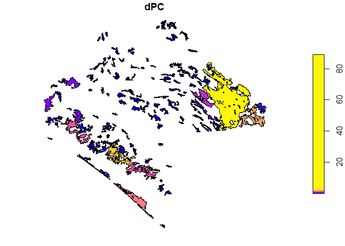
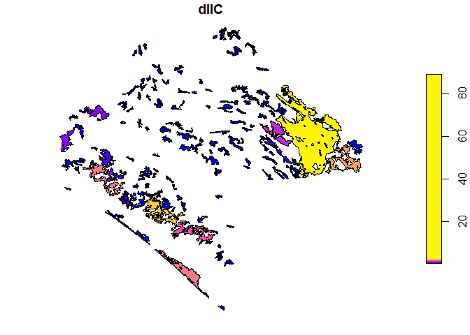
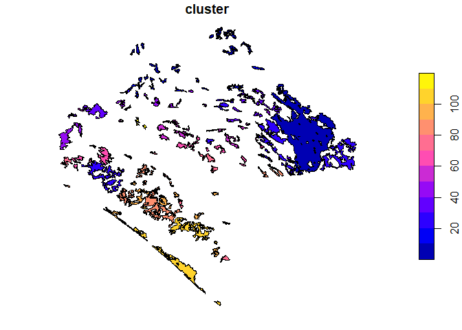

[](https://ci.appveyor.com/project/OscarGOGO/Makurhini)

<!-- README.md is generated from README.Rmd. Please edit that file -->

# Makurhini: Analyzing landscape connectivity.


## Overview

<strong>Makurhini</strong> *(Connect in Purépecha language)* is an R
package for calculating fragmentation and landscape connectivity indices
used in conservation planning. Makurhini provides a set of functions to
identify connectivity of protected areas networks and the importance of
landscape elements for maintaining connectivity. This package allows the
evaluation of scenarios under landscape connectivity changes and
presents an additional improvement, the inclusion of landscape
heterogeneity as a constraining factor for connectivity.

The network connectivity indices calculated in Makurhini package have
been previously published (e.g., Pascual-Hortal & Saura, 2006.
*Landscape ecology*, <https://doi.org/10.1007/s10980-006-0013-z>; Saura
& Pascual-Hortal, 2007. *Lanscape and urban planning*,
<https://doi.org/10.1016/j.landurbplan.2007.03.005>; Saura & Rubio,
2010. *Ecography*, <https://doi.org/10.1111/j.1600-0587.2009.05760.x>;
Saura et al., 2011. *Ecological indicators*,
<https://doi.org/10.1016/j.ecolind.2010.06.011>; Saura et al., 2017.
*Ecological indicators*,
<http://dx.doi.org/10.1016/j.ecolind.2016.12.047>; Saura et al., 2018.
*Biological conservation*,
<https://doi.org/10.1016/j.biocon.2017.12.020>), and it allows the
integration of efficient and useful workflow for landscape management
and monitoring of global conservation targets.

### Citing Makurhini package

A formal paper detailing this package is forthcoming, but until it is
published, please use the something like the following to cite if you
use it in your work:

<code> <i> Godínez-Gómez, O. and Correa Ayram C.A. 2020. Makurhini:
Analyzing landscape connectivity.
  
[](https://doi.org/10.5281/zenodo.3771605)
</code> </i>

## Installation

  - Pre-install
    [Rtools](https://cran.r-project.org/bin/windows/Rtools/).
  - Pre-install devtools (<code>install.packages(“devtools”)</code>) and
    remotes (<code>install.packages(“remotes”)</code>) packages.

You can install the released version of Makurhini from
[GitHub](https://github.com) with:

``` r
library(devtools)
library(remotes)
install_github("connectscape/Makurhini", dependencies = TRUE, upgrade = "never")
```

In case it does not appear in the list of packages, close the R session
and reopen.

## Summary of main *Makurhini* functions

<table class="table table-condensed">

<thead>

<tr>

<th style="text-align:left;">

Function

</th>

<th style="text-align:left;">

Purpose

</th>

</tr>

</thead>

<tbody>

<tr>

<td style="text-align:left;">

<span style="font-style: italic">MK\_Fragmentation </span>

</td>

<td style="text-align:left;">

Calculate patch and landscape statistics (e.g., mean size patches, edge
density, core area percent, shape index, fractal dimension index,
effective mesh size).

</td>

</tr>

<tr>

<td style="text-align:left;">

<span style="font-style: italic">distancefile </span>

</td>

<td style="text-align:left;">

Get a table or matrix with the distances between pairs of nodes. Two
Euclidean distances (‘centroid’ and ‘edge’) and two cost distances that
consider the landscape heterogeneity (‘least-cost’ and ‘commute-time,
this last is analogous to the resistance distance of circuitscape, see
’gdistance’ package).

</td>

</tr>

<tr>

<td style="text-align:left;">

<span style="font-style: italic">MK\_RMCentrality </span>

</td>

<td style="text-align:left;">

Estimate centrality measures under one or several dispersal distances
(e.g., betweenness centrality, node memberships, modularity). It uses
the ‘distancefile ()’ to calculate the distances of the nodes so they
can be calculated using Euclidean or cost distances that consider the
landscape heterogeneity.

</td>

</tr>

<tr>

<td style="text-align:left;">

<span style="font-style: italic">MK\_dPCIIC </span>

</td>

<td style="text-align:left;">

Calculate the integral index of connectivity (IIC) and probability of
connectivity (PC) indices under one or several dispersal distances. It
computes overall and index fractions (dPC or dIIC, intra, flux and
connector) and the effect of restauration in the landscape connectivity
when adding new nodes (restoration scenarios). It uses the
‘distancefile()’.

</td>

</tr>

<tr>

<td style="text-align:left;">

<span style="font-style: italic">MK\_dECA </span>

</td>

<td style="text-align:left;">

Estimate the Equivalent Connected Area (ECA) and compare the relative
change in ECA (dECA) between time periods using one or several dispersal
distances. It uses the ‘distancefile()’.

</td>

</tr>

<tr>

<td style="text-align:left;">

<span style="font-style: italic">MK\_ProtConn </span>

</td>

<td style="text-align:left;">

Estimate the Protected Connected (ProtConn) indicator and fractions for
one region using one or several dispersal distances and transboundary
buffer areas (e.g., ProtConn, ProtUnconn, RelConn, ProtConn\[design\],
ProtConn\[bound\], ProtConn\[Prot\], ProtConn\[Within\],
ProtConn\[Contig\], ProtConn\[Trans\], ProtConn\[Unprot\]). It uses the
’distancefile()

</td>

</tr>

<tr>

<td style="text-align:left;">

<span style="font-style: italic">MK\_ProtConnMult </span>

</td>

<td style="text-align:left;">

Estimate the ProtConn indicator and fractions for multiple regions. It
uses the ‘distancefile()’.

</td>

</tr>

<tr>

<td style="text-align:left;">

<span style="font-style: italic">MK\_Connect\_grid </span>

</td>

<td style="text-align:left;">

Compute the ProtConn indicator and fractions, PC or IIC overall
connectivity metrics (ECA) in a regular grid. It uses the
‘distancefile()’.

</td>

</tr>

<tr>

<td style="text-align:left;">

<span style="font-style: italic">test\_metric\_distance</span>

</td>

<td style="text-align:left;">

Compare ECA or ProtConn connectivity metrics using one or up to four
types of distances, computed in the ‘distancefile()’ function, and
multiple dispersion distances.

</td>

</tr>

</tbody>

</table>

## Example

This is a basic example which shows you how to solve some common
problems:

  - Protected Connected Land (<i>ProtConn</i>)
  - Equivalent Connectivity Area (<i>ECA</i>)
  - Integral index of connectivity (<i>IIC</i>) and fractions
    (<i>dIICintra, dIICflux and dIICconnector</i>)
  - Probability of connectivity (<i>PC</i>) and fractions (<i>dPCintra,
    dPCflux and dPCconnector</i>)
  - Centrality measures (e.g., betweenness centrality, node memberships,
    and modularity)

### Protected Connected Land (ProtConn)

In the following example, we will calculate the connectivity of the
protected areas network in four ecoregions of the Colombian Amazon
neighboring countries using the ProtConn indicator and its fractions. We
considered a transboundary distance of 50 km.


``` r
test_protconn <- MK_ProtConnMult(nodes = Protected_areas, region = ecoregions,
                    attribute = "Intersected area", area_unit = "ha",
                    distance = list(type= "centroid"),
                    distance_thresholds = 10000,
                    probability = 0.5, transboundary = 50000,
                    plot = TRUE, CI = NULL, parallel = TRUE, intern = FALSE)
test_protconn[[1]][[1]]
```


ProtConn value: 

### Equivalent Connectivity Area (ECA)

Example in the Biosphere Reserve Mariposa Monarca, Mexico, with
old-growth vegetation fragments of four times (?list\_forest\_patches).

``` r
data("list_forest_patches", package = "Makurhini")
data("study_area", package = "Makurhini")

Max_attribute <- unit_convert(gArea(study_area), "m2", "ha")
```

``` r
dECA_test <- MK_dECA(nodes= list_forest_patches, attribute = NULL, area_unit = "ha",
                  distance = list(type= "centroid"), metric = "PC",
                  probability = 0.05, distance_thresholds = 5000,
                  LA = Max_attribute, plot= c("1993", "2003", "2007", "2011"))
dECA_test
```

ECA table:


ECA plot:


Another way to analyze the ECA (and ProtConn indicator) is by using the
*‘MK\_Connect\_grid()’* that estimates the index values on a grid. An
example of its application is the following, on the Andean-Amazon
Piedmont. The analysis was performed using a grid of hexagons each with
an area of 10,000 ha and a forest/non-forest map to measure changes in
Andean-Amazon connectivity.


### Integral index of connectivity (IIC) and fractions (Intra, Flux and Connector)

Example with 142 old-growth vegetation fragments in southeast Mexico
(?vegetation\_patches).

``` r
data("vegetation_patches", package = "Makurhini")
nrow(vegetation_patches) # Number of patches
#> [1] 142

IIC <- MK_dPCIIC(nodes = vegetation_patches, attribute = NULL,
                distance = list(type = "centroid"),
                metric = "IIC", distance_thresholds = 10000) #10 km
head(IIC)
#> Simple feature collection with 6 features and 5 fields
#> geometry type:  POLYGON
#> dimension:      XY
#> bbox:           xmin: 3542152 ymin: 498183.1 xmax: 3711426 ymax: 696540.5
#> CRS:            +proj=lcc +lat_1=17.5 +lat_2=29.5 +lat_0=12 +lon_0=-102 +x_0=2500000 +y_0=0 +datum=WGS84 +units=m +no_defs
#> # A tibble: 6 x 6
#>      id   dIIC dIICintra dIICflux dIICconnector                    geometry
#>   <int>  <dbl>     <dbl>    <dbl>         <dbl>               <POLYGON [m]>
#> 1     1 88.8    88.1      0.360           0.357 ((3676911 589967.3, 367693~
#> 2     2  0.736   0.0181   0.00766         0.710 ((3558044 696202.5, 355797~
#> 3     3  0.738   0.0119   0.0143          0.712 ((3569169 687776.4, 356914~
#> 4     4  0.719   0.00115  0.00194         0.716 ((3547317 685713.2, 354736~
#> 5     5  0.732   0.00554  0.0124          0.714 ((3567471 684357.4, 356738~
#> 6     6  0.732   0.0141   0.00677         0.711 ((3590569 672451.7, 359009~
```



### Probability of connectivity (PC) and fractions (Intra, Flux and Connector)

``` r
PC <- MK_dPCIIC(nodes = vegetation_patches, attribute = NULL,
                distance = list(type = "centroid"),
                metric = "PC", probability = 0.05,
                distance_thresholds = 10000)
head(PC)
#> Simple feature collection with 6 features and 5 fields
#> geometry type:  POLYGON
#> dimension:      XY
#> bbox:           xmin: 3542152 ymin: 498183.1 xmax: 3711426 ymax: 696540.5
#> CRS:            +proj=lcc +lat_1=17.5 +lat_2=29.5 +lat_0=12 +lon_0=-102 +x_0=2500000 +y_0=0 +datum=WGS84 +units=m +no_defs
#> # A tibble: 6 x 6
#>      id      dPC dPCintra dPCflux dPCconnector                     geometry
#>   <int>    <dbl>    <dbl>   <dbl>        <dbl>                <POLYGON [m]>
#> 1     1 89.1     89.1     7.78e-4     0.       ((3676911 589967.3, 3676931~
#> 2     2  0.0194   0.0184  1.00e-3     5.72e-15 ((3558044 696202.5, 3557972~
#> 3     3  0.0152   0.0121  3.11e-3     3.82e-15 ((3569169 687776.4, 3569146~
#> 4     4  0.00153  0.00117 3.61e-4     5.05e-15 ((3547317 685713.2, 3547363~
#> 5     5  0.00833  0.00560 2.73e-3     0.       ((3567471 684357.4, 3567380~
#> 6     6  0.0143   0.0143  6.32e-5     0.       ((3590569 672451.7, 3590090~
```



### Centrality measures

``` r
centrality_test <- MK_RMCentrality(nodes = vegetation_patches,
                                distance = list(type = "centroid"),
                                 distance_thresholds = 10000,
                                 probability = 0.05,
                                 write = NULL)
head(centrality_test)
#> Simple feature collection with 6 features and 7 fields
#> geometry type:  POLYGON
#> dimension:      XY
#> bbox:           xmin: 3542152 ymin: 498183.1 xmax: 3711426 ymax: 696540.5
#> CRS:            +proj=lcc +lat_1=17.5 +lat_2=29.5 +lat_0=12 +lon_0=-102 +x_0=2500000 +y_0=0 +datum=WGS84 +units=m +no_defs
#> # A tibble: 6 x 8
#>      id degree eigen   close   BWC cluster modules
#>   <int>  <dbl> <dbl>   <dbl> <dbl>   <dbl>   <dbl>
#> 1     1      0     0 4.99e-5     0       1       1
#> 2     2      0     0 4.99e-5     0       2       2
#> 3     3      1     0 5.03e-5     0       3       4
#> 4     4      0     0 4.99e-5     0       4       3
#> 5     5      1     0 5.03e-5     0       3       4
#> 6     6      0     0 4.99e-5     0       5       5
#> # ... with 1 more variable: geometry <POLYGON [m]>
```

Examples:



Moreover, you can change distance using the distance
(<code>?distancefile</code>) argument:

Euclidean distances:

  - distance = list(type= “centroid”)
  - distance = list(type= “edge”)

Least cost distances:

  - distance = list(type= “least-cost”, resistance = “resistance
    raster”)
  - distance = list(type= “commute-time”, resistance = “resistance
    raster”)
