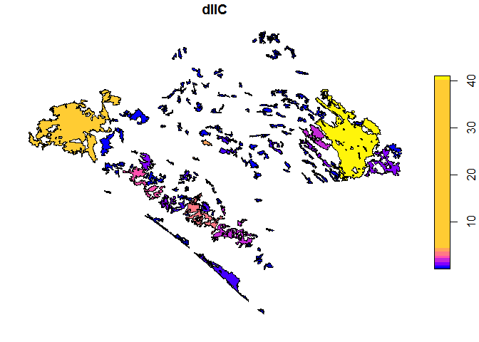
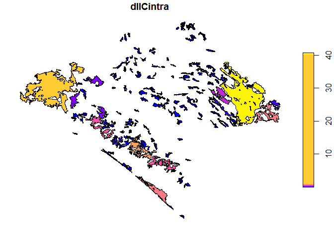
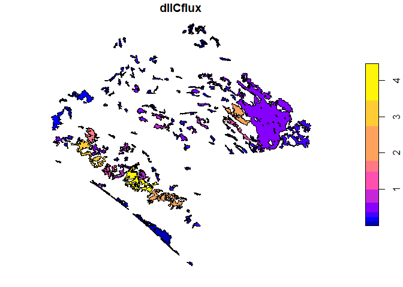
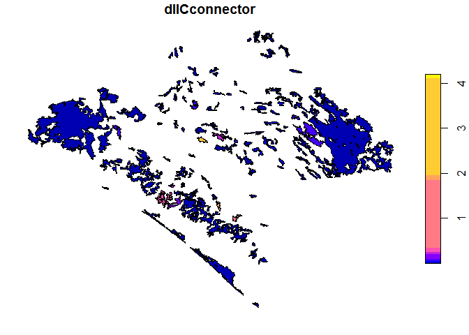

[](https://travis-ci.org/OscarGOGO/Makurhini)

[](https://ci.appveyor.com/project/OscarGOGO/Makurhini)

<!-- README.md is generated from README.Rmd. Please edit that file -->

# Makurhini

The goal of Makurhini is to provide a set of functions to estimate
landscape fragmentation and connectivity metrics

## Installation

You can install the released version of Makurhini from
[CRAN](https://CRAN.R-project.org) with:

``` r
install.packages("Makurhini")
```

## Example

This is a basic example which shows you how to solve a common problem:

``` r
library(sf)
#> Linking to GEOS 3.6.1, GDAL 2.2.3, PROJ 4.9.3
## basic example code
```

``` r
library(Makurhini)
ruta <- system.file("extdata", "Fragmentation.RData", package = "Makurhini")
load(ruta)
cores
#> Simple feature collection with 142 features and 1 field
#> geometry type:  POLYGON
#> dimension:      XY
#> bbox:           xmin: 3340120 ymin: 322869.6 xmax: 3739484 ymax: 696540.5
#> epsg (SRID):    NA
#> proj4string:    +proj=lcc +lat_1=17.5 +lat_2=29.5 +lat_0=12 +lon_0=-102 +x_0=2500000 +y_0=0 +datum=WGS84 +units=m +no_defs
#> # A tibble: 142 x 2
#>       id                                                           geometry
#>    <int>                                                      <POLYGON [m]>
#>  1     1 ((3676911 589967.3, 3676931 589895.5, 3676948 589818.3, 3676957 5~
#>  2     2 ((3558044 696202.5, 3557972 696280.9, 3557957 696291.6, 3558118 6~
#>  3     3 ((3569169 687776.4, 3569146 687749.5, 3569096 687745.6, 3569069 6~
#>  4     4 ((3547317 685713.2, 3547363 685573.9, 3547391 685401.4, 3547435 6~
#>  5     5 ((3567471 684357.4, 3567380 684214.3, 3567303 684046, 3567224 683~
#>  6     6 ((3590569 672451.7, 3590090 672574.9, 3589912 672547.5, 3589761 6~
#>  7     7 ((3570789 670959.4, 3570860 671015.4, 3570909 671019.3, 3570932 6~
#>  8     8 ((3440118 666273.2, 3440372 666849.2, 3440584 667001.7, 3440838 6~
#>  9     9 ((3451637 671232.4, 3451616 671287.1, 3451535 671315.1, 3451413 6~
#> 10    10 ((3444396 671675.7, 3444715 671834.8, 3444873 672019, 3444773 672~
#> # ... with 132 more rows
```


``` r
nrow(cores)
#> [1] 142
IIC <- MK_dPCIIC(nodes = cores, id = "id", attribute = NULL,
                 distance = list(type = "centroid"),
                 metric = "IIC", distance_thresholds = 30000,
                 LA = NULL, overall = FALSE)
plot(IIC["dIIC"], breaks = "jenks")
```



``` r
plot(IIC["dIICintra"], breaks = "jenks")
```



``` r
plot(IIC["dIICflux"], breaks = "jenks")
```



``` r
plot(IIC["dIICconnector"], breaks = "jenks")
```


