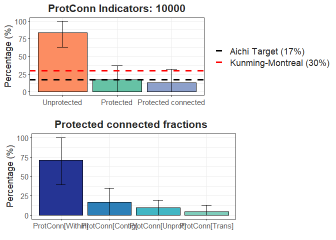

[](https://ci.appveyor.com/project/OscarGOGO/Makurhini)

[](https://lifecycle.r-lib.org/articles/stages.html#experimental)

<!-- README.md is generated from README.Rmd. Please edit that file -->

# Makurhini: Analyzing landscape connectivity.


## NEWS

- Thank you for using Makurhini. **We have a new version Makurhini
  3.0!**
- An update was made in the estimation of short distances between nodes,
  which can improve the processing of the functions that estimate
  connectivity indices.
- Two new functions have been added: MK_dPCIIC_links and MK_Focal_nodes.
  The first one is used to estimate the link importance for conservation
  and restoration. The second estimates the focal Integral Index of
  Connectivity (IIC<sub>f</sub>) or the focal Probability of
  Connectivity (PC<sub>f</sub>) under one or more distance thresholds.
  Furthermore, this function estimates the composite connectivity index
  (CCI<sub>f</sub>; for further details, please see Latorre-Cárdenas et
  al., 2023. <https://doi.org/10.3390/land12030631>).

## Overview

<strong>Makurhini</strong> *(Connect in Purépecha language)* is an R
package for calculating fragmentation and landscape connectivity indices
used in conservation planning. Makurhini provides a set of functions to
identify connectivity of protected areas networks and the importance of
landscape elements for maintaining connectivity. This package allows the
evaluation of scenarios under landscape connectivity changes and
presents an additional improvement, the inclusion of landscape
heterogeneity as a constraining factor for connectivity.

The network connectivity indices calculated in Makurhini package have
been previously published (e.g., Pascual-Hortal & Saura, 2006.
*Landscape ecology*, <https://doi.org/10.1007/s10980-006-0013-z>; Saura
& Pascual-Hortal, 2007. *Lanscape and urban planning*,
<https://doi.org/10.1016/j.landurbplan.2007.03.005>; Saura & Rubio,
2010. *Ecography*, <https://doi.org/10.1111/j.1600-0587.2009.05760.x>;
Saura et al., 2011. *Ecological indicators*,
<https://doi.org/10.1016/j.ecolind.2010.06.011>; Saura et al., 2017.
*Ecological indicators*,
<http://dx.doi.org/10.1016/j.ecolind.2016.12.047>; Saura et al., 2018.
*Biological conservation*,
<https://doi.org/10.1016/j.biocon.2017.12.020>), and it allows the
integration of efficient and useful workflow for landscape management
and monitoring of global conservation targets.

### Citing Makurhini package

A formal paper detailing this package is forthcoming, but until it is
published, please use the something like the following to cite if you
use it in your work:

<code> <i> Godínez-Gómez, O. and Correa Ayram C.A. 2020. Makurhini:
Analyzing landscape connectivity.
[](https://doi.org/10.5281/zenodo.3771605)
</code> </i>

## Installation

- Depends: R (\> 4.0.0), igraph (\>= 1.2.6)
- Pre-install [Rtools](https://cran.r-project.org/bin/windows/Rtools/).
- Pre-install devtools (<code>install.packages(“devtools”)</code>) and
  remotes (<code>install.packages(“remotes”)</code>) packages.
- **It is recommended to install the R igraph package (\>= 1.2.6)
  beforehand.**

You can install the released version of Makurhini from
[GitHub](https://github.com) with:

``` r
library(devtools)
library(remotes)
install_github("connectscape/Makurhini", dependencies = TRUE, upgrade = "never")
```

In case it does not appear in the list of packages, close the R session
and reopen.

**If the following error occurs during installation**:

``` r
Using github PAT
from envvar GITHUB_PAT Error: Failed to install 'unknown package' from
GitHub: HTTP error 401. Bad credentials
```

Then you can **try the following**:

``` r
Sys.getenv("GITHUB_PAT")
Sys.unsetenv("GITHUB_PAT")
```

## Makurhini on Linux

To install Makurhini on linux consider the following steps:

1)  Use the **Linux command line** to install the *unit* package:

    `sudo apt-get install -y libudunits2-dev`

2)  Use the **Linux command line** to install *gdal*:

    `sudo apt install libgdal-dev`

3)  Use the **Linux command line** to install *libfontconfig* and
    *libharfbuzz*:

    `sudo apt install libfontconfig1-dev`

    `sudo apt install libharfbuzz-dev libfribidi-dev`

4)  You can now install the *devtools* and *remotes* packages, and the
    *terra*, *raster* and *sf* packages directly in your **R or
    RStudio**.

    `install.packages(c('remotes', 'devtools', 'terra', 'raster', 'sf'))`

5)  Use the **Linux command line** to install *igraph*:

    `sudo apt-get install libnlopt-dev`

    `sudo apt-get install r-cran-igraph`

6)  You can now install the *gdistance*, *graph4lg* and *ggpubr*
    packages directly in your **R or RStudio.**

    `install.packages(c('gdistance', 'graph4lg', 'ggpubr'))`

7)  Now you can install Makurhini directly in your **R or RStudio.**

``` r
library(devtools)
library(remotes)
install_github("connectscape/Makurhini", dependencies = TRUE, upgrade = "never")
```

Note that the installation of Makurhini on Linux depends on your version
of operating system and that you manage to install the packages that
Makurhini depends on.

## Summary of main *Makurhini* functions

<table class="table table-condensed">
<thead>
<tr>
<th style="text-align:left;">
Function
</th>
<th style="text-align:left;">
Purpose
</th>
</tr>
</thead>
<tbody>
<tr>
<td style="text-align:left;">
<span style="font-style: italic">MK_Fragmentation </span>
</td>
<td style="text-align:left;">
Calculate patch and landscape statistics (e.g., mean size patches, edge
density, core area percent, shape index, fractal dimension index,
effective mesh size).
</td>
</tr>
<tr>
<td style="text-align:left;">
<span style="font-style: italic">distancefile </span>
</td>
<td style="text-align:left;">
Get a table or matrix with the distances between pairs of nodes. Two
Euclidean distances (‘centroid’ and ‘edge’) and two cost distances that
consider the landscape heterogeneity (‘least-cost’ and ‘commute-time,
this last is analogous to the resistance distance of circuitscape, see
’gdistance’ package).
</td>
</tr>
<tr>
<td style="text-align:left;">
<span style="font-style: italic">MK_RMCentrality </span>
</td>
<td style="text-align:left;">
Estimate centrality measures under one or several dispersal distances
(e.g., betweenness centrality, node memberships, modularity). It uses
the ‘distancefile ()’ to calculate the distances of the nodes so they
can be calculated using Euclidean or cost distances that consider the
landscape heterogeneity.
</td>
</tr>
<tr>
<td style="text-align:left;">
<span style="font-style: italic">MK_BCentrality </span>
</td>
<td style="text-align:left;">
Calculate the BC, BCIIC and BCPC indexes under one or several distance
thresholds using the command line of CONEFOR. It uses the ‘distancefile
()’ to calculate the distances of the nodes so they can be calculated
using Euclidean or cost distances that consider the landscape
heterogeneity
</td>
</tr>
<tr>
<td style="text-align:left;">
<span style="font-style: italic">MK_dPCIIC </span>
</td>
<td style="text-align:left;">
Calculate the integral index of connectivity (IIC) and probability of
connectivity (PC) indices under one or several dispersal distances. It
computes overall and index fractions (dPC or dIIC, intra, flux and
connector) and the effect of restauration in the landscape connectivity
when adding new nodes (restoration scenarios). It uses the
‘distancefile()’.
</td>
</tr>
<tr>
<td style="text-align:left;">
<span style="font-style: italic">MK_dECA </span>
</td>
<td style="text-align:left;">
Estimate the Equivalent Connected Area (ECA) and compare the relative
change in ECA (dECA) between time periods using one or several dispersal
distances. It uses the ‘distancefile()’.
</td>
</tr>
<tr>
<td style="text-align:left;">
<span style="font-style: italic">MK_ProtConn </span>
</td>
<td style="text-align:left;">
Estimate the Protected Connected (ProtConn) indicator and fractions for
one region using one or several dispersal distances and transboundary
buffer areas (e.g., ProtConn, ProtUnconn, RelConn, ProtConn\[design\],
ProtConn\[bound\], ProtConn\[Prot\], ProtConn\[Within\],
ProtConn\[Contig\], ProtConn\[Trans\], ProtConn\[Unprot\]). It uses the
’distancefile(). This function estimates what we call the ProtConn delta
(dProtConn) which estimates the contribution of each protected area to
connectivity in the region (ProtConn value)
</td>
</tr>
<tr>
<td style="text-align:left;">
<span style="font-style: italic">MK_ProtConnMult </span>
</td>
<td style="text-align:left;">
Estimate the ProtConn indicator and fractions for multiple regions. It
uses the ‘distancefile()’.
</td>
</tr>
<tr>
<td style="text-align:left;">
<span style="font-style: italic">MK_ProtConn_raster </span>
</td>
<td style="text-align:left;">
Estimate Protected Connected (ProtConn) indicator and fractions for one
region using raster inputs (nodes and region). It uses the
‘distancefile()’.
</td>
</tr>
<tr>
<td style="text-align:left;">
<span style="font-style: italic">MK_Connect_grid </span>
</td>
<td style="text-align:left;">
Compute the ProtConn indicator and fractions, PC or IIC overall
connectivity metrics (ECA) in a regular grid. It uses the
‘distancefile()’.
</td>
</tr>
<tr>
<td style="text-align:left;">
<span style="font-style: italic">MK_dPCIIC_links </span>
</td>
<td style="text-align:left;">
Estimate the link importance for conservation and restoration. It
calculates the contribution of each individual link to maintain (mode:
link removal) or improve (mode: link change) the overall connectivity.
</td>
</tr>
<tr>
<td style="text-align:left;">
<span style="font-style: italic">MK_Focal_nodes </span>
</td>
<td style="text-align:left;">
Estimate the focal Integral Index of Connectivity or the focal
Probability of Connectivity and the Composite Connectivity Index under
one or more distance thresholds.
</td>
</tr>
<tr>
<td style="text-align:left;">
<span style="font-style: italic">test_metric_distance</span>
</td>
<td style="text-align:left;">
Compare ECA or ProtConn connectivity metrics using one or up to four
types of distances, computed in the ‘distancefile()’ function, and
multiple dispersion distances.
</td>
</tr>
</tbody>
</table>

## Example

This is a basic example which shows you how to solve some common
problems:

- [Protected Connected Land
  (ProtConn)](#protected-connected-land-protconn)
- [Equivalent Connectivity Area
  (ECA)](#equivalent-connectivity-area-eca)
- [Integral index of connectivity (IIC) and fractions (Intra, Flux and
  Connector)](#integral-index-of-connectivity-iic-and-fractions-intra-flux-and-connector)
- [Probability of connectivity (PC) and fractions (Intra, Flux and
  Connector)](#probability-of-connectivity-pc-and-fractions-intra-flux-and-connector)
- [Centrality measures](#centrality-measures) (e.g., betweenness
  centrality, node memberships, and modularity)
- [Fragmentation statistics](#fragmentation-statistics)

### Protected Connected Land (ProtConn)

In the following example, we will calculate the connectivity of the
protected areas network in four ecoregions of the Colombian Amazon
neighboring countries using the ProtConn indicator and its fractions. We
considered a transboundary distance of 50 km.


``` r
test_protconn <- MK_ProtConnMult(nodes = Protected_areas, 
                                 region = ecoregions,
                                 area_unit = "ha",
                                 distance = list(type= "centroid"),
                                 distance_thresholds = 10000,
                                 probability = 0.5, 
                                 transboundary = 50000,
                                 plot = TRUE, 
                                 CI = NULL, 
                                 parallel = 4, 
                                 intern = FALSE)
test_protconn[[1]][[1]]
```


ProtConn value: 

### Equivalent Connectivity Area (ECA)

Example in the Biosphere Reserve Mariposa Monarca, Mexico, with
old-growth vegetation fragments of four times (?list_forest_patches).

``` r
data("list_forest_patches", package = "Makurhini")
class(list_forest_patches)
#[1] "list"
data("study_area", package = "Makurhini")
class(study_area)[1]
#[1] "SpatialPolygonsDataFrame"

Max_attribute <- unit_convert(gArea(study_area), "m2", "ha")
```

``` r
dECA_test <- MK_dECA(nodes= list_forest_patches, attribute = NULL, area_unit = "ha",
                  distance = list(type= "centroid"), metric = "PC",
                  probability = 0.05, distance_thresholds = 5000,
                  LA = Max_attribute, plot= c("1993", "2003", "2007", "2011"))
dECA_test
```

ECA table:


ECA plot:


Another way to analyze the ECA (and ProtConn indicator) is by using the
*‘MK_Connect_grid()’* that estimates the index values on a grid. An
example of its application is the following, on the Andean-Amazon
Piedmont. The analysis was performed using a grid of hexagons each with
an area of 10,000 ha and a forest/non-forest map to measure changes in
Andean-Amazon connectivity.


### Integral index of connectivity (IIC) and fractions (Intra, Flux and Connector)

Example with 142 old-growth vegetation fragments in southeast Mexico
(?vegetation_patches).

``` r
data("vegetation_patches", package = "Makurhini")
nrow(vegetation_patches) # Number of patches
#> [1] 142
```

``` r
class(vegetation_patches)[1]
#> [1] "sf"
```

``` r
#[1] "sf"

IIC <- MK_dPCIIC(nodes = vegetation_patches, attribute = NULL,
                distance = list(type = "centroid"),
                metric = "IIC", distance_thresholds = 10000) #10 km
head(IIC)
#> Simple feature collection with 6 features and 5 fields
#> Geometry type: POLYGON
#> Dimension:     XY
#> Bounding box:  xmin: 3542152 ymin: 498183.1 xmax: 3711426 ymax: 696540.5
#> Projected CRS: +proj=lcc +lat_1=17.5 +lat_2=29.5 +lat_0=12 +lon_0=-102 +x_0=2500000 +y_0=0 +datum=WGS84 +units=m +no_defs
#>   id       dIIC  dIICintra  dIICflux dIICconnector
#> 1  1 88.6878612 88.6878612 0.0000000   0.00000e+00
#> 2  2  0.0228809  0.0182727 0.0046082   0.00000e+00
#> 3  3  0.0202227  0.0120311 0.0081916   0.00000e+00
#> 4  4  0.0057703  0.0011621 0.0046082   0.00000e+00
#> 5  5  0.0137690  0.0055774 0.0081916   2.91434e-15
#> 6  6  0.0142244  0.0142244 0.0000000   0.00000e+00
#>                         geometry
#> 1 POLYGON ((3676911 589967.3,...
#> 2 POLYGON ((3558044 696202.5,...
#> 3 POLYGON ((3569169 687776.4,...
#> 4 POLYGON ((3547317 685713.2,...
#> 5 POLYGON ((3567471 684357.4,...
#> 6 POLYGON ((3590569 672451.7,...
```


### Probability of connectivity (PC) and fractions (Intra, Flux and Connector)

``` r
PC <- MK_dPCIIC(nodes = vegetation_patches, attribute = NULL,
                distance = list(type = "centroid"),
                metric = "PC", probability = 0.05,
                distance_thresholds = 10000)
head(PC)
#> Simple feature collection with 6 features and 5 fields
#> Geometry type: POLYGON
#> Dimension:     XY
#> Bounding box:  xmin: 3542152 ymin: 498183.1 xmax: 3711426 ymax: 696540.5
#> Projected CRS: +proj=lcc +lat_1=17.5 +lat_2=29.5 +lat_0=12 +lon_0=-102 +x_0=2500000 +y_0=0 +datum=WGS84 +units=m +no_defs
#>   id        dPC   dPCintra   dPCflux dPCconnector
#> 1  1 89.0768714 89.0760927 0.0007786  0.00000e+00
#> 2  2  0.0192790  0.0183527 0.0009263  0.00000e+00
#> 3  3  0.0136652  0.0120837 0.0015814  0.00000e+00
#> 4  4  0.0017528  0.0011672 0.0005856  0.00000e+00
#> 5  5  0.0069526  0.0056018 0.0013508  4.42528e-15
#> 6  6  0.0143397  0.0142867 0.0000531  0.00000e+00
#>                         geometry
#> 1 POLYGON ((3676911 589967.3,...
#> 2 POLYGON ((3558044 696202.5,...
#> 3 POLYGON ((3569169 687776.4,...
#> 4 POLYGON ((3547317 685713.2,...
#> 5 POLYGON ((3567471 684357.4,...
#> 6 POLYGON ((3590569 672451.7,...
```


### Centrality measures

``` r
centrality_test <- MK_RMCentrality(nodes = vegetation_patches,
                                distance = list(type = "centroid"),
                                 distance_thresholds = 10000,
                                 probability = 0.05,
                                 write = NULL)
head(centrality_test)
#> Simple feature collection with 6 features and 7 fields
#> Geometry type: POLYGON
#> Dimension:     XY
#> Bounding box:  xmin: 3542152 ymin: 498183.1 xmax: 3711426 ymax: 696540.5
#> Projected CRS: +proj=lcc +lat_1=17.5 +lat_2=29.5 +lat_0=12 +lon_0=-102 +x_0=2500000 +y_0=0 +datum=WGS84 +units=m +no_defs
#> # A tibble: 6 × 8
#>      id degree    eigen close   BWC cluster modules                     geometry
#>   <int>  <dbl>    <dbl> <dbl> <dbl>   <dbl>   <dbl>                <POLYGON [m]>
#> 1     1      0 2.27e-17   NaN     0       1       1 ((3676911 589967.3, 3676931…
#> 2     2      1 3.63e-16     1     0       2       2 ((3558044 696202.5, 3557972…
#> 3     3      1 3.86e-16     1     0       3       3 ((3569169 687776.4, 3569146…
#> 4     4      1 3.40e-16     1     0       2       2 ((3547317 685713.2, 3547363…
#> 5     5      1 3.40e-16     1     0       3       3 ((3567471 684357.4, 3567380…
#> 6     6      0 2.27e-17   NaN     0       4       4 ((3590569 672451.7, 3590090…
```

Examples:


Moreover, you can change distance using the distance
(<code>?distancefile</code>) argument:

Euclidean distances:

- distance = list(type= “centroid”)
- distance = list(type= “edge”)

Least cost distances:

- distance = list(type= “least-cost”, resistance = “resistance raster”)
- distance = list(type= “commute-time”, resistance = “resistance
  raster”)

### Fragmentation statistics

*‘MK_Fragmentation()’* estimates fragmentation statistics at the
landscape and patch level.

Example:

``` r
data("vegetation_patches", package = "Makurhini")
nrow(vegetation_patches) # Number of patches
#> [1] 142
```

To define the edge of the patches we can use, for example, a distance of
500 m from the limit of the patches.


``` r
Fragmentation_test <- MK_Fragmentation(patches = vegetation_patches, edge_distance = 500,
                                       plot = TRUE, min_patch_area = 100, 
                                       landscape_area = NULL, area_unit = "km2", 
                                       perimeter_unit = "km")
```



- The results are presented as a list, the first result is called
  *“Summary landscape metrics (Viewer Panel)”* and it has fragmentation
  statistics at landscape level.

``` r
class(Fragmentation_test)
#> [1] "list"
```

``` r
names(Fragmentation_test)
#> [1] "Summary landscape metrics (Viewer Panel)"
#> [2] "Patch statistics shapefile"
```

``` r
Fragmentation_test$`Summary landscape metrics (Viewer Panel)`
```

<table class="table table-condensed">
<thead>
<tr>
<th style="text-align:left;">
Metric
</th>
<th style="text-align:center;">
Value
</th>
</tr>
</thead>
<tbody>
<tr>
<td style="text-align:left;">
Patch area (km2)
</td>
<td style="text-align:center;">
12792.2046
</td>
</tr>
<tr>
<td style="text-align:left;">
Number of patches
</td>
<td style="text-align:center;">
142.0000
</td>
</tr>
<tr>
<td style="text-align:left;">
Size (mean)
</td>
<td style="text-align:center;">
90.0859
</td>
</tr>
<tr>
<td style="text-align:left;">
Patches \< minimum patch area
</td>
<td style="text-align:center;">
126.0000
</td>
</tr>
<tr>
<td style="text-align:left;">
Patches \< minimum patch area (%)
</td>
<td style="text-align:center;">
30.8017
</td>
</tr>
<tr>
<td style="text-align:left;">
Total edge
</td>
<td style="text-align:center;">
12297.5330
</td>
</tr>
<tr>
<td style="text-align:left;">
Edge density
</td>
<td style="text-align:center;">
0.9613
</td>
</tr>
<tr>
<td style="text-align:left;">
Patch density
</td>
<td style="text-align:center;">
1.1101
</td>
</tr>
<tr>
<td style="text-align:left;">
Total Core Area (km2)
</td>
<td style="text-align:center;">
7622.3940
</td>
</tr>
<tr>
<td style="text-align:left;">
Cority
</td>
<td style="text-align:center;">
1.0000
</td>
</tr>
<tr>
<td style="text-align:left;">
Shape Index (mean)
</td>
<td style="text-align:center;">
2.7918
</td>
</tr>
<tr>
<td style="text-align:left;">
FRAC (mean)
</td>
<td style="text-align:center;">
2.3154
</td>
</tr>
<tr>
<td style="text-align:left;">
MESH (km2)
</td>
<td style="text-align:center;">
1543.1463
</td>
</tr>
</tbody>
</table>

- The second output *“Patch statistics shapefile”* is a shapefile with
  patch level fragmentation statistics that can be saved using
  write_sf() from *‘sf’* package
  (<https://cran.r-project.org/web/packages/sf/index.html>).

``` r
head(Fragmentation_test[[2]])
#> Simple feature collection with 6 features and 9 fields
#> Geometry type: POLYGON
#> Dimension:     XY
#> Bounding box:  xmin: 3542152 ymin: 498183.1 xmax: 3711426 ymax: 696540.5
#> Projected CRS: +proj=lcc +lat_1=17.5 +lat_2=29.5 +lat_0=12 +lon_0=-102 +x_0=2500000 +y_0=0 +datum=WGS84 +units=m +no_defs
#>   id      Area        CA CAPercent Perimeter EdgePercent   PARA ShapeIndex
#> 1  1 4195.5691 3541.3806   84.4076  1412.046     15.5924 2.9713     6.1496
#> 2  2   60.2227   11.9415   19.8289   167.982     80.1711 0.3585     6.1063
#> 3  3   48.8665    6.2099   12.7079   127.049     87.2921 0.3846     5.1270
#> 4  4   15.1875    7.4210   48.8626    18.536     51.1374 0.8194     1.3417
#> 5  5   33.2716   13.0877   39.3360    55.038     60.6640 0.6045     2.6917
#> 6  6   53.1344   11.3564   21.3730   111.123     78.6270 0.4782     4.3004
#>     FRAC                       geometry
#> 1 1.7389 POLYGON ((3676911 589967.3,...
#> 2 2.5006 POLYGON ((3558044 696202.5,...
#> 3 2.4914 POLYGON ((3569169 687776.4,...
#> 4 2.1465 POLYGON ((3547317 685713.2,...
#> 5 2.2872 POLYGON ((3567471 684357.4,...
#> 6 2.3714 POLYGON ((3590569 672451.7,...
```


We can make a loop where we explore different edge depths. In the
following example, We will explore 10 edge depths (*edge_distance
argument*): 100, 200, 300, 400, 500, 600, 700, 800, 900 and 1000 meters.
We will apply the *‘MK_Fragmentation’* function using the previous
distances and then, we will extract the core area percentage and edge
percentage statistics. Finally, we will plot the average of the patch
core area percentage and edge percentage (% core area + % edge = 100%).

    #>   Edge.distance      Type Percentage
    #> 1           100 Core Area   83.50499
    #> 2           100      Edge   16.49501
    #> 3           200 Core Area   68.18515
    #> 4           200      Edge   31.81485
    #> 5           300 Core Area   54.77234
    #> 6           300      Edge   45.22766


The average core area percentage (average patch area that has the least
possible edge effect) for all patches decreases by more than 70% when
considering an edge effect with an edge depth distance of 1 km.

| Edge depth distance (m) | Core Area (%) |
|-------------------------|:-------------:|
| 100                     |     83.5%     |
| 500                     |    34.14%     |
| 1000                    |     9.78%     |
