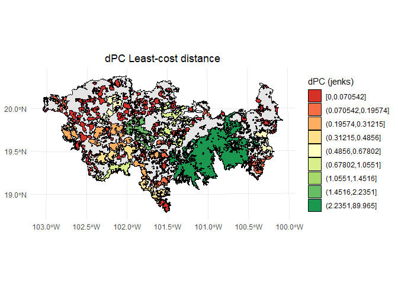
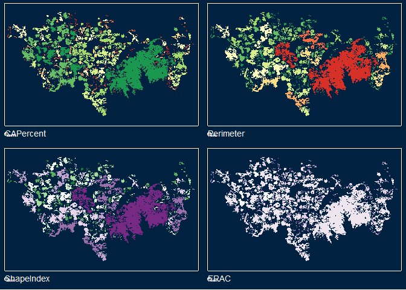

[](https://ci.appveyor.com/project/OscarGOGO/Makurhini)

[](https://lifecycle.r-lib.org/articles/stages.html#experimental)

<!-- README.md is generated from README.Rmd. Please edit that file -->

# Makurhini: Analyzing landscape connectivity.


## NEWS

Thank you for using Makurhini. **We have a new version Makurhini 3.0!**

An update was made in the estimation of short distances between nodes,
which can improve the processing of the functions that estimate
connectivity indices.

Two new functions have been added: **MK_dPCIIC_links and
MK_Focal_nodes**. The first one is used to estimate the link importance
for conservation and restoration. The second estimates the focal
Integral Index of Connectivity (IIC<sub>f</sub>) or the focal
Probability of Connectivity (PC<sub>f</sub>) under one or more distance
thresholds. Furthermore, this function estimates the composite
connectivity index (CCI<sub>f</sub>; for further details, please see
Latorre-Cárdenas et al., 2023. <https://doi.org/10.3390/land12030631>).

## Overview

<strong>Makurhini</strong> *(Connect in Purépecha language)* is an R
package for calculating fragmentation and landscape connectivity indices
used in conservation planning. Makurhini provides a set of functions to
identify connectivity of protected areas networks and the importance of
landscape elements for maintaining connectivity. This package allows the
evaluation of scenarios under landscape connectivity changes and
presents an additional improvement, the inclusion of landscape
heterogeneity as a constraining factor for connectivity.

The network connectivity indices calculated in Makurhini package have
been previously published (e.g., Pascual-Hortal & Saura, 2006.
*Landscape ecology*, <https://doi.org/10.1007/s10980-006-0013-z>; Saura
& Pascual-Hortal, 2007. *Lanscape and urban planning*,
<https://doi.org/10.1016/j.landurbplan.2007.03.005>; Saura & Rubio,
2010. *Ecography*, <https://doi.org/10.1111/j.1600-0587.2009.05760.x>;
Saura et al., 2011. *Ecological indicators*,
<https://doi.org/10.1016/j.ecolind.2010.06.011>; Saura et al., 2017.
*Ecological indicators*,
<http://dx.doi.org/10.1016/j.ecolind.2016.12.047>; Saura et al., 2018.
*Biological conservation*,
<https://doi.org/10.1016/j.biocon.2017.12.020>), and it allows the
integration of efficient and useful workflow for landscape management
and monitoring of global conservation targets.

### Citing Makurhini package

A formal paper detailing this package is forthcoming, but until it is
published, please use the something like the following to cite if you
use it in your work:

<code> <i> Godínez-Gómez, O. and Correa Ayram C.A. 2020. Makurhini:
Analyzing landscape connectivity.
[](https://doi.org/10.5281/zenodo.3771605)
</code> </i>

## Installation

- Depends: R (\> 4.0.0), igraph (\>= 1.2.6)
- Pre-install [Rtools](https://cran.r-project.org/bin/windows/Rtools/).
- Pre-install devtools (<code>install.packages(“devtools”)</code>) and
  remotes (<code>install.packages(“remotes”)</code>) packages.
- **It is recommended to install the R igraph package (\>= 1.2.6)
  beforehand.**

You can install the released version of Makurhini from
[GitHub](https://github.com) with:

``` r
library(devtools)
library(remotes)
install_github("connectscape/Makurhini", dependencies = TRUE, upgrade = "never")
```

In case it does not appear in the list of packages, close the R session
and reopen.

**If the following error occurs during installation**:

``` r
Using github PAT
from envvar GITHUB_PAT Error: Failed to install 'unknown package' from
GitHub: HTTP error 401. Bad credentials
```

Then you can **try the following**:

``` r
Sys.getenv("GITHUB_PAT")
Sys.unsetenv("GITHUB_PAT")
```

## Makurhini on Linux

To install Makurhini on linux consider the following steps:

1)  Use the **Linux command line** to install the *unit* package:

    `sudo apt-get install -y libudunits2-dev`

2)  Use the **Linux command line** to install *gdal*:

    `sudo apt install libgdal-dev`

3)  Use the **Linux command line** to install *libfontconfig* and
    *libharfbuzz*:

    `sudo apt install libfontconfig1-dev`

    `sudo apt install libharfbuzz-dev libfribidi-dev`

4)  You can now install the *devtools* and *remotes* packages, and the
    *terra*, *raster* and *sf* packages directly in your **R or
    RStudio**.

    `install.packages(c('remotes', 'devtools', 'terra', 'raster', 'sf'))`

5)  Use the **Linux command line** to install *igraph*:

    `sudo apt-get install libnlopt-dev`

    `sudo apt-get install r-cran-igraph`

6)  You can now install the *gdistance*, *graph4lg* and *ggpubr*
    packages directly in your **R or RStudio.**

    `install.packages(c('gdistance', 'graph4lg', 'ggpubr'))`

7)  Now you can install Makurhini directly in your **R or RStudio.**

``` r
library(devtools)
library(remotes)
install_github("connectscape/Makurhini", dependencies = TRUE, upgrade = "never")
```

Note that the installation of Makurhini on Linux depends on your version
of operating system and that you manage to install the packages that
Makurhini depends on.

## Summary of main *Makurhini* functions

<table class="table table-condensed">
<thead>
<tr>
<th style="text-align:left;">
Function
</th>
<th style="text-align:left;">
Purpose
</th>
</tr>
</thead>
<tbody>
<tr>
<td style="text-align:left;">
<span style="font-style: italic">MK_Fragmentation </span>
</td>
<td style="text-align:left;">
Calculate patch and landscape statistics (e.g., mean size patches, edge
density, core area percent, shape index, fractal dimension index,
effective mesh size).
</td>
</tr>
<tr>
<td style="text-align:left;">
<span style="font-style: italic">distancefile </span>
</td>
<td style="text-align:left;">
Get a table or matrix with the distances between pairs of nodes. Two
Euclidean distances (‘centroid’ and ‘edge’) and two cost distances that
consider the landscape heterogeneity (‘least-cost’ and ‘commute-time,
this last is analogous to the resistance distance of circuitscape, see
’gdistance’ package).
</td>
</tr>
<tr>
<td style="text-align:left;">
<span style="font-style: italic">MK_RMCentrality </span>
</td>
<td style="text-align:left;">
Estimate centrality measures under one or several dispersal distances
(e.g., betweenness centrality, node memberships, modularity). It uses
the ‘distancefile ()’ to calculate the distances of the nodes so they
can be calculated using Euclidean or cost distances that consider the
landscape heterogeneity.
</td>
</tr>
<tr>
<td style="text-align:left;">
<span style="font-style: italic">MK_BCentrality </span>
</td>
<td style="text-align:left;">
Calculate the BC, BCIIC and BCPC indexes under one or several distance
thresholds using the command line of CONEFOR. It uses the ‘distancefile
()’ to calculate the distances of the nodes so they can be calculated
using Euclidean or cost distances that consider the landscape
heterogeneity
</td>
</tr>
<tr>
<td style="text-align:left;">
<span style="font-style: italic">MK_dPCIIC </span>
</td>
<td style="text-align:left;">
Calculate the integral index of connectivity (IIC) and probability of
connectivity (PC) indices under one or several dispersal distances. It
computes overall and index fractions (dPC or dIIC, intra, flux and
connector) and the effect of restauration in the landscape connectivity
when adding new nodes (restoration scenarios). It uses the
‘distancefile()’.
</td>
</tr>
<tr>
<td style="text-align:left;">
<span style="font-style: italic">MK_dECA </span>
</td>
<td style="text-align:left;">
Estimate the Equivalent Connected Area (ECA) and compare the relative
change in ECA (dECA) between time periods using one or several dispersal
distances. It uses the ‘distancefile()’.
</td>
</tr>
<tr>
<td style="text-align:left;">
<span style="font-style: italic">MK_ProtConn </span>
</td>
<td style="text-align:left;">
Estimate the Protected Connected (ProtConn) indicator and fractions for
one region using one or several dispersal distances and transboundary
buffer areas (e.g., ProtConn, ProtUnconn, RelConn, ProtConn\[design\],
ProtConn\[bound\], ProtConn\[Prot\], ProtConn\[Within\],
ProtConn\[Contig\], ProtConn\[Trans\], ProtConn\[Unprot\]). It uses the
’distancefile(). This function estimates what we call the ProtConn delta
(dProtConn) which estimates the contribution of each protected area to
connectivity in the region (ProtConn value)
</td>
</tr>
<tr>
<td style="text-align:left;">
<span style="font-style: italic">MK_ProtConnMult </span>
</td>
<td style="text-align:left;">
Estimate the ProtConn indicator and fractions for multiple regions. It
uses the ‘distancefile()’.
</td>
</tr>
<tr>
<td style="text-align:left;">
<span style="font-style: italic">MK_ProtConn_raster </span>
</td>
<td style="text-align:left;">
Estimate Protected Connected (ProtConn) indicator and fractions for one
region using raster inputs (nodes and region). It uses the
‘distancefile()’.
</td>
</tr>
<tr>
<td style="text-align:left;">
<span style="font-style: italic">MK_Connect_grid </span>
</td>
<td style="text-align:left;">
Compute the ProtConn indicator and fractions, PC or IIC overall
connectivity metrics (ECA) in a regular grid. It uses the
‘distancefile()’.
</td>
</tr>
<tr>
<td style="text-align:left;">
<span style="font-style: italic">MK_dPCIIC_links </span>
</td>
<td style="text-align:left;">
Estimate the link importance for conservation and restoration. It
calculates the contribution of each individual link to maintain (mode:
link removal) or improve (mode: link change) the overall connectivity.
</td>
</tr>
<tr>
<td style="text-align:left;">
<span style="font-style: italic">MK_Focal_nodes </span>
</td>
<td style="text-align:left;">
Estimate the focal Integral Index of Connectivity or the focal
Probability of Connectivity and the Composite Connectivity Index under
one or more distance thresholds.
</td>
</tr>
<tr>
<td style="text-align:left;">
<span style="font-style: italic">test_metric_distance</span>
</td>
<td style="text-align:left;">
Compare ECA or ProtConn connectivity metrics using one or up to four
types of distances, computed in the ‘distancefile()’ function, and
multiple dispersion distances.
</td>
</tr>
</tbody>
</table>

## Examples

[Protected Connected Land
(ProtConn)](#protected-connected-land-protconn) [Equivalent Connectivity
Area (ECA)](#equivalent-connectivity-area-eca) [Integral index of
connectivity (IIC) and fractions (Intra, Flux and
Connector)](#integral-index-of-connectivity-iic-and-fractions-intra-flux-and-connector)
[Probability of connectivity (PC) and fractions (Intra, Flux and
Connector)](#probability-of-connectivity-pc-and-fractions-intra-flux-and-connector)
[Centrality measures](#centrality-measures) (e.g., betweenness
centrality, node memberships, and modularity) [Fragmentation
statistics](#fragmentation-statistics)

### Protected Connected Land (ProtConn)

In this example, we assess the connectivity of Colombia’s protected
areas network in 33 ecoregions of great importance to the country using
the Protected Connected Indicator (ProtConn). Particularly, we have
1,530 polygons of protected areas. The spatial information utilized in
this example is derived from the connectivity assessment study of
protected areas in the Andean Amazon region, as conducted by Castillo et
al., (2020). In order to estimate the ProtConn index, we employ the
`MK_ProtConn()` and `MK_ProtConn_mult()` functions. In this example, we
will utilize an organism median dispersal distance threshold of 10 km, a
connection probability pij = 0.5, and a transboundary PA search radius
of 50 km (for further details, please refer to Castillo et al., 2020;
Saura et al., 2017). We used Euclidean distances, particularly the
distances between edges to establish the connections between nodes
(PAs).

    #> [1] 1530
    #> [1] 33


#### MK_ProtConn()

This function calculates the Protected Connected indicator (ProtConn)
for a region, its fractions and the importance (contribution) of each
protected area to maintain connectivity in the region under one or more
distance thresholds.

``` r
#Select first ecoregion
Ecoregion_1 <- Ecoregions[1,]

#keep = 0.6 simplify the geometry and reduce the number of vertices
ProtConn_1 <- MK_ProtConn(nodes = Protected_areas, region = Ecoregion_1, 
                          area_unit = "ha", 
                          distance = list(type= "edge", keep = 0.6),
                          distance_thresholds = 10000, probability = 0.5,
                          transboundary = 50000, plot = TRUE, 
                          delta = TRUE, intern = FALSE)
```

A dynamic table is generated, displaying the ProtConn values and their
fractions. Additionally, a graph is produced, illustrating the ProtConn
values and comparing them with the percentage of protected and connected
area recommended for a region in the Aichi and Kumming-Montreal targets.

``` r
class(ProtConn_1)
#> [1] "list"
```

``` r
names(ProtConn_1)
#> [1] "Protected Connected (Viewer Panel)" "ProtConn Plot"                     
#> [3] "ProtConn_Delta"
```

``` r
ProtConn_1$`Protected Connected (Viewer Panel)`
```

<table class="table table-condensed">
<thead>
<tr>
<th style="text-align:left;">
Index
</th>
<th style="text-align:center;">
Value
</th>
<th style="text-align:left;">
ProtConn indicator
</th>
<th style="text-align:center;">
Percentage
</th>
</tr>
</thead>
<tbody>
<tr>
<td style="text-align:left;">
<span style="color: #636363; font-weight: bold">EC(PC) </span>
</td>
<td style="text-align:center;">
4407396.27
</td>
<td style="text-align:left;">
<span style="color: #636363; font-weight: bold">Prot </span>
</td>
<td style="text-align:center;">
<span style="display: block; padding: 0 4px; border-radius: 4px; background-color: #ffd17f">36.7627</span>
</td>
</tr>
<tr>
<td style="text-align:left;">
<span style="color: #636363; font-weight: bold">PC </span>
</td>
<td style="text-align:center;">
6.5700e-02
</td>
<td style="text-align:left;">
<span style="color: #636363; font-weight: bold">Unprotected </span>
</td>
<td style="text-align:center;">
<span style="display: block; padding: 0 4px; border-radius: 4px; background-color: #ffb93a">63.2373</span>
</td>
</tr>
<tr>
<td style="text-align:left;">
<span style="color: #636363; font-weight: bold">Maximum landscape
attribute</span>
</td>
<td style="text-align:center;">
17196418.45
</td>
<td style="text-align:left;">
<span style="color: #636363; font-weight: bold">ProtConn </span>
</td>
<td style="text-align:center;">
<span style="display: block; padding: 0 4px; border-radius: 4px; background-color: #ffdc9b">25.6297</span>
</td>
</tr>
<tr>
<td style="text-align:left;">
<span style="color: #636363; font-weight: bold">Protected surface
</span>
</td>
<td style="text-align:center;">
6321860.45
</td>
<td style="text-align:left;">
<span style="color: #636363; font-weight: bold">ProtUnconn </span>
</td>
<td style="text-align:center;">
<span style="display: block; padding: 0 4px; border-radius: 4px; background-color: #ffe9c1">11.1329</span>
</td>
</tr>
<tr>
<td style="text-align:left;">
<span style="color: #636363; font-weight: bold"> </span>
</td>
<td style="text-align:center;">
</td>
<td style="text-align:left;">
<span style="color: #636363; font-weight: bold">RelConn </span>
</td>
<td style="text-align:center;">
<span style="display: block; padding: 0 4px; border-radius: 4px; background-color: #ffb329">69.7168</span>
</td>
</tr>
<tr>
<td style="text-align:left;">
<span style="color: #636363; font-weight: bold"> </span>
</td>
<td style="text-align:center;">
</td>
<td style="text-align:left;">
<span style="color: #636363; font-weight: bold">ProtConn_Prot </span>
</td>
<td style="text-align:center;">
<span style="display: block; padding: 0 4px; border-radius: 4px; background-color: #ffa500">85.7949</span>
</td>
</tr>
<tr>
<td style="text-align:left;">
<span style="color: #636363; font-weight: bold"> </span>
</td>
<td style="text-align:center;">
</td>
<td style="text-align:left;">
<span style="color: #636363; font-weight: bold">ProtConn_Trans </span>
</td>
<td style="text-align:center;">
<span style="display: block; padding: 0 4px; border-radius: 4px; background-color: #fff1d9">1.8411</span>
</td>
</tr>
<tr>
<td style="text-align:left;">
<span style="color: #636363; font-weight: bold"> </span>
</td>
<td style="text-align:center;">
</td>
<td style="text-align:left;">
<span style="color: #636363; font-weight: bold">ProtConn_Unprot </span>
</td>
<td style="text-align:center;">
<span style="display: block; padding: 0 4px; border-radius: 4px; background-color: #ffe8be">12.3640</span>
</td>
</tr>
<tr>
<td style="text-align:left;">
<span style="color: #636363; font-weight: bold"> </span>
</td>
<td style="text-align:center;">
</td>
<td style="text-align:left;">
<span style="color: #636363; font-weight: bold">ProtConn_Within </span>
</td>
<td style="text-align:center;">
<span style="display: block; padding: 0 4px; border-radius: 4px; background-color: #ffa500">85.7256</span>
</td>
</tr>
<tr>
<td style="text-align:left;">
<span style="color: #636363; font-weight: bold"> </span>
</td>
<td style="text-align:center;">
</td>
<td style="text-align:left;">
<span style="color: #636363; font-weight: bold">ProtConn_Contig </span>
</td>
<td style="text-align:center;">
<span style="display: block; padding: 0 4px; border-radius: 4px; background-color: #ffe6b9">14.2744</span>
</td>
</tr>
<tr>
<td style="text-align:left;">
<span style="color: #636363; font-weight: bold"> </span>
</td>
<td style="text-align:center;">
</td>
<td style="text-align:left;">
<span style="color: #636363; font-weight: bold">ProtConn_Within_land</span>
</td>
<td style="text-align:center;">
<span style="display: block; padding: 0 4px; border-radius: 4px; background-color: #ffdfa5">21.9712</span>
</td>
</tr>
<tr>
<td style="text-align:left;">
<span style="color: #636363; font-weight: bold"> </span>
</td>
<td style="text-align:center;">
</td>
<td style="text-align:left;">
<span style="color: #636363; font-weight: bold">ProtConn_Contig_land</span>
</td>
<td style="text-align:center;">
<span style="display: block; padding: 0 4px; border-radius: 4px; background-color: #fff0d4">3.6585</span>
</td>
</tr>
<tr>
<td style="text-align:left;">
<span style="color: #636363; font-weight: bold"> </span>
</td>
<td style="text-align:center;">
</td>
<td style="text-align:left;">
<span style="color: #636363; font-weight: bold">ProtConn_Unprot_land</span>
</td>
<td style="text-align:center;">
<span style="display: block; padding: 0 4px; border-radius: 4px; background-color: #fff0d6">3.1688</span>
</td>
</tr>
<tr>
<td style="text-align:left;">
<span style="color: #636363; font-weight: bold"> </span>
</td>
<td style="text-align:center;">
</td>
<td style="text-align:left;">
<span style="color: #636363; font-weight: bold">ProtConn_Trans_land
</span>
</td>
<td style="text-align:center;">
<span style="display: block; padding: 0 4px; border-radius: 4px; background-color: #fff3dd">0.4719</span>
</td>
</tr>
</tbody>
</table>

``` r
ProtConn_1$`ProtConn Plot`
```


ProtConn delta or the higher contribution to ProtConn value in the
ecoregion (grey polygon):

``` r
ggplot()+
  geom_sf(data = Ecoregion_1)+
  geom_sf(data = ProtConn_1$ProtConn_Delta, 
          aes(fill = cut(dProtConn, breaks = classIntervals(ProtConn_1$ProtConn_Delta$dProtConn, 5, "jenks")[[2]])), color = NA)+
  scale_fill_brewer(type = "qual",
                    palette = "RdYlGn",
                    name = "dProtConn",
                    na.translate = FALSE)+
  theme_minimal() +
  theme(
    legend.position.inside = c(0.1,0.21),
    legend.key.height = unit(0.4, "cm"),
    legend.key.width = unit(0.5, "cm")
  )
```


#### MK_ProtConnMult()

In order to facilitate the estimation of the ProtConn index for a
variety of geographical regions, the MK_ProtConnMult function has been
incorporated into Makurhini, which enables the estimation of the
ProtConn indicator and fractions for different regions.

``` r
ProtConn_2 <- MK_ProtConnMult(nodes = Protected_areas, 
                              region = Ecoregions,
                              area_unit = "ha",
                              distance = list(type= "edge"),
                              distance_thresholds = 10000,
                              probability = 0.5, transboundary = 50000,
                              plot = TRUE, parallel = 4)
```

A dynamic table and vector (sf class) are generated, displaying the
ProtConn values and their fractions. Additionally, a graph is produced,
illustrating the ProtConn values and comparing them with the percentage
of protected and connected area recommended for a region in the Aichi
and Kumming-Montreal targets.

``` r
class(ProtConn_2)
#> [1] "list"
```

``` r
names(ProtConn_2)
#> [1] "ProtConn_10000"
```

Table:

``` r
ProtConn_2$ProtConn_10000$ProtConn_overall10000
```

<table class="table table-condensed">
<thead>
<tr>
<th style="text-align:left;">
</th>
<th style="text-align:left;">
ProtConn indicator
</th>
<th style="text-align:right;">
Values (%)
</th>
<th style="text-align:right;">
SD
</th>
<th style="text-align:right;">
SEM
</th>
<th style="text-align:right;">
normal.lower
</th>
<th style="text-align:right;">
normal.upper
</th>
<th style="text-align:right;">
basic.lower
</th>
<th style="text-align:right;">
basic.upper
</th>
<th style="text-align:right;">
percent.lower
</th>
<th style="text-align:right;">
percent.upper
</th>
<th style="text-align:right;">
bca.lower
</th>
<th style="text-align:right;">
bca.upper
</th>
</tr>
</thead>
<tbody>
<tr>
<td style="text-align:left;">
3
</td>
<td style="text-align:left;">
<span style="color: #636363; font-weight: bold">Prot </span>
</td>
<td style="text-align:right;">
<span style="display: block; padding: 0 4px; border-radius: 4px; background-color: #fde7d0">16.850</span>
</td>
<td style="text-align:right;">
<span style="display: block; padding: 0 4px; border-radius: 4px; background-color: #e3a3c6">20.205</span>
</td>
<td style="text-align:right;">
<span style="display: block; padding: 0 4px; border-radius: 4px; background-color: #faeff5">3.517</span>
</td>
<td style="text-align:right;">
10.450
</td>
<td style="text-align:right;">
23.565
</td>
<td style="text-align:right;">
10.144
</td>
<td style="text-align:right;">
23.013
</td>
<td style="text-align:right;">
10.687
</td>
<td style="text-align:right;">
23.556
</td>
<td style="text-align:right;">
11.994
</td>
<td style="text-align:right;">
26.502
</td>
</tr>
<tr>
<td style="text-align:left;">
4
</td>
<td style="text-align:left;">
<span style="color: #636363; font-weight: bold">Unprotected </span>
</td>
<td style="text-align:right;">
<span style="display: block; padding: 0 4px; border-radius: 4px; background-color: #f88b13">83.150</span>
</td>
<td style="text-align:right;">
<span style="display: block; padding: 0 4px; border-radius: 4px; background-color: #e3a3c6">20.205</span>
</td>
<td style="text-align:right;">
<span style="display: block; padding: 0 4px; border-radius: 4px; background-color: #faeff5">3.517</span>
</td>
<td style="text-align:right;">
76.435
</td>
<td style="text-align:right;">
89.550
</td>
<td style="text-align:right;">
76.987
</td>
<td style="text-align:right;">
89.856
</td>
<td style="text-align:right;">
76.444
</td>
<td style="text-align:right;">
89.313
</td>
<td style="text-align:right;">
73.498
</td>
<td style="text-align:right;">
88.006
</td>
</tr>
<tr>
<td style="text-align:left;">
5
</td>
<td style="text-align:left;">
<span style="color: #636363; font-weight: bold">ProtConn </span>
</td>
<td style="text-align:right;">
<span style="display: block; padding: 0 4px; border-radius: 4px; background-color: #fdeddb">12.796</span>
</td>
<td style="text-align:right;">
<span style="display: block; padding: 0 4px; border-radius: 4px; background-color: #e5a9ca">18.949</span>
</td>
<td style="text-align:right;">
<span style="display: block; padding: 0 4px; border-radius: 4px; background-color: #faf0f6">3.299</span>
</td>
<td style="text-align:right;">
6.868
</td>
<td style="text-align:right;">
19.068
</td>
<td style="text-align:right;">
6.570
</td>
<td style="text-align:right;">
18.109
</td>
<td style="text-align:right;">
7.482
</td>
<td style="text-align:right;">
19.021
</td>
<td style="text-align:right;">
8.490
</td>
<td style="text-align:right;">
22.404
</td>
</tr>
<tr>
<td style="text-align:left;">
6
</td>
<td style="text-align:left;">
<span style="color: #636363; font-weight: bold">ProtUnconn </span>
</td>
<td style="text-align:right;">
<span style="display: block; padding: 0 4px; border-radius: 4px; background-color: #fef9f4">4.054</span>
</td>
<td style="text-align:right;">
<span style="display: block; padding: 0 4px; border-radius: 4px; background-color: #f6e2ed">6.338</span>
</td>
<td style="text-align:right;">
<span style="display: block; padding: 0 4px; border-radius: 4px; background-color: #fdfafc">1.103</span>
</td>
<td style="text-align:right;">
1.911
</td>
<td style="text-align:right;">
6.169
</td>
<td style="text-align:right;">
1.754
</td>
<td style="text-align:right;">
5.938
</td>
<td style="text-align:right;">
2.171
</td>
<td style="text-align:right;">
6.354
</td>
<td style="text-align:right;">
2.425
</td>
<td style="text-align:right;">
6.913
</td>
</tr>
<tr>
<td style="text-align:left;">
7
</td>
<td style="text-align:left;">
<span style="color: #636363; font-weight: bold">RelConn </span>
</td>
<td style="text-align:right;">
<span style="display: block; padding: 0 4px; border-radius: 4px; background-color: #fab060">56.111</span>
</td>
<td style="text-align:right;">
<span style="display: block; padding: 0 4px; border-radius: 4px; background-color: #ce5d9b">35.608</span>
</td>
<td style="text-align:right;">
<span style="display: block; padding: 0 4px; border-radius: 4px; background-color: #f6e3ee">6.199</span>
</td>
<td style="text-align:right;">
44.054
</td>
<td style="text-align:right;">
68.028
</td>
<td style="text-align:right;">
43.221
</td>
<td style="text-align:right;">
68.126
</td>
<td style="text-align:right;">
44.095
</td>
<td style="text-align:right;">
69.001
</td>
<td style="text-align:right;">
43.661
</td>
<td style="text-align:right;">
68.590
</td>
</tr>
<tr>
<td style="text-align:left;">
8
</td>
<td style="text-align:left;">
<span style="color: #636363; font-weight: bold">ProtConn_Prot </span>
</td>
<td style="text-align:right;">
<span style="display: block; padding: 0 4px; border-radius: 4px; background-color: #f8972d">74.027</span>
</td>
<td style="text-align:right;">
<span style="display: block; padding: 0 4px; border-radius: 4px; background-color: #d370a6">31.381</span>
</td>
<td style="text-align:right;">
<span style="display: block; padding: 0 4px; border-radius: 4px; background-color: #f7e6f0">5.463</span>
</td>
<td style="text-align:right;">
63.387
</td>
<td style="text-align:right;">
85.165
</td>
<td style="text-align:right;">
63.818
</td>
<td style="text-align:right;">
86.275
</td>
<td style="text-align:right;">
61.778
</td>
<td style="text-align:right;">
84.235
</td>
<td style="text-align:right;">
59.889
</td>
<td style="text-align:right;">
83.739
</td>
</tr>
<tr>
<td style="text-align:left;">
9
</td>
<td style="text-align:left;">
<span style="color: #636363; font-weight: bold">ProtConn_Trans </span>
</td>
<td style="text-align:right;">
<span style="display: block; padding: 0 4px; border-radius: 4px; background-color: #fef9f3">4.455</span>
</td>
<td style="text-align:right;">
<span style="display: block; padding: 0 4px; border-radius: 4px; background-color: #f3d9e7">8.406</span>
</td>
<td style="text-align:right;">
<span style="display: block; padding: 0 4px; border-radius: 4px; background-color: #fdf9fb">1.463</span>
</td>
<td style="text-align:right;">
1.632
</td>
<td style="text-align:right;">
7.209
</td>
<td style="text-align:right;">
1.412
</td>
<td style="text-align:right;">
6.995
</td>
<td style="text-align:right;">
1.916
</td>
<td style="text-align:right;">
7.499
</td>
<td style="text-align:right;">
2.304
</td>
<td style="text-align:right;">
8.206
</td>
</tr>
<tr>
<td style="text-align:left;">
10
</td>
<td style="text-align:left;">
<span style="color: #636363; font-weight: bold">ProtConn_Unprot </span>
</td>
<td style="text-align:right;">
<span style="display: block; padding: 0 4px; border-radius: 4px; background-color: #fef2e5">9.397</span>
</td>
<td style="text-align:right;">
<span style="display: block; padding: 0 4px; border-radius: 4px; background-color: #f1d3e4">9.631</span>
</td>
<td style="text-align:right;">
<span style="display: block; padding: 0 4px; border-radius: 4px; background-color: #fcf8fa">1.677</span>
</td>
<td style="text-align:right;">
6.181
</td>
<td style="text-align:right;">
12.529
</td>
<td style="text-align:right;">
6.037
</td>
<td style="text-align:right;">
12.391
</td>
<td style="text-align:right;">
6.403
</td>
<td style="text-align:right;">
12.757
</td>
<td style="text-align:right;">
6.534
</td>
<td style="text-align:right;">
12.830
</td>
</tr>
<tr>
<td style="text-align:left;">
11
</td>
<td style="text-align:left;">
<span style="color: #636363; font-weight: bold">ProtConn_Within </span>
</td>
<td style="text-align:right;">
<span style="display: block; padding: 0 4px; border-radius: 4px; background-color: #f99c35">71.013</span>
</td>
<td style="text-align:right;">
<span style="display: block; padding: 0 4px; border-radius: 4px; background-color: #d36ea5">31.782</span>
</td>
<td style="text-align:right;">
<span style="display: block; padding: 0 4px; border-radius: 4px; background-color: #f7e6ef">5.533</span>
</td>
<td style="text-align:right;">
60.339
</td>
<td style="text-align:right;">
82.255
</td>
<td style="text-align:right;">
60.864
</td>
<td style="text-align:right;">
83.601
</td>
<td style="text-align:right;">
58.426
</td>
<td style="text-align:right;">
81.163
</td>
<td style="text-align:right;">
57.382
</td>
<td style="text-align:right;">
80.824
</td>
</tr>
<tr>
<td style="text-align:left;">
12
</td>
<td style="text-align:left;">
<span style="color: #636363; font-weight: bold">ProtConn_Contig </span>
</td>
<td style="text-align:right;">
<span style="display: block; padding: 0 4px; border-radius: 4px; background-color: #fde7d0">16.865</span>
</td>
<td style="text-align:right;">
<span style="display: block; padding: 0 4px; border-radius: 4px; background-color: #e6accb">18.255</span>
</td>
<td style="text-align:right;">
<span style="display: block; padding: 0 4px; border-radius: 4px; background-color: #faf1f6">3.178</span>
</td>
<td style="text-align:right;">
10.604
</td>
<td style="text-align:right;">
22.906
</td>
<td style="text-align:right;">
10.287
</td>
<td style="text-align:right;">
22.692
</td>
<td style="text-align:right;">
11.038
</td>
<td style="text-align:right;">
23.444
</td>
<td style="text-align:right;">
11.009
</td>
<td style="text-align:right;">
23.413
</td>
</tr>
<tr>
<td style="text-align:left;">
13
</td>
<td style="text-align:left;">
<span style="color: #636363; font-weight: bold">ProtConn_Within_land</span>
</td>
<td style="text-align:right;">
<span style="display: block; padding: 0 4px; border-radius: 4px; background-color: #fef4e9">7.954</span>
</td>
<td style="text-align:right;">
<span style="display: block; padding: 0 4px; border-radius: 4px; background-color: #f0cee0">10.850</span>
</td>
<td style="text-align:right;">
<span style="display: block; padding: 0 4px; border-radius: 4px; background-color: #fcf7fa">1.889</span>
</td>
<td style="text-align:right;">
4.231
</td>
<td style="text-align:right;">
11.549
</td>
<td style="text-align:right;">
3.801
</td>
<td style="text-align:right;">
11.277
</td>
<td style="text-align:right;">
4.630
</td>
<td style="text-align:right;">
12.107
</td>
<td style="text-align:right;">
4.939
</td>
<td style="text-align:right;">
12.968
</td>
</tr>
<tr>
<td style="text-align:left;">
14
</td>
<td style="text-align:left;">
<span style="color: #636363; font-weight: bold">ProtConn_Contig_land</span>
</td>
<td style="text-align:right;">
<span style="display: block; padding: 0 4px; border-radius: 4px; background-color: #fefdfb">1.620</span>
</td>
<td style="text-align:right;">
<span style="display: block; padding: 0 4px; border-radius: 4px; background-color: #fcf5f9">2.264</span>
</td>
<td style="text-align:right;">
<span style="display: block; padding: 0 4px; border-radius: 4px; background-color: #fefefe">0.394</span>
</td>
<td style="text-align:right;">
0.864
</td>
<td style="text-align:right;">
2.363
</td>
<td style="text-align:right;">
0.793
</td>
<td style="text-align:right;">
2.343
</td>
<td style="text-align:right;">
0.897
</td>
<td style="text-align:right;">
2.446
</td>
<td style="text-align:right;">
0.986
</td>
<td style="text-align:right;">
2.531
</td>
</tr>
<tr>
<td style="text-align:left;">
15
</td>
<td style="text-align:left;">
<span style="color: #636363; font-weight: bold">ProtConn_Unprot_land</span>
</td>
<td style="text-align:right;">
<span style="display: block; padding: 0 4px; border-radius: 4px; background-color: #fefefd">0.879</span>
</td>
<td style="text-align:right;">
<span style="display: block; padding: 0 4px; border-radius: 4px; background-color: #fdfafc">1.156</span>
</td>
<td style="text-align:right;">
<span style="display: block; padding: 0 4px; border-radius: 4px; background-color: #fefefe">0.201</span>
</td>
<td style="text-align:right;">
0.490
</td>
<td style="text-align:right;">
1.261
</td>
<td style="text-align:right;">
0.492
</td>
<td style="text-align:right;">
1.230
</td>
<td style="text-align:right;">
0.527
</td>
<td style="text-align:right;">
1.265
</td>
<td style="text-align:right;">
0.541
</td>
<td style="text-align:right;">
1.318
</td>
</tr>
<tr>
<td style="text-align:left;">
16
</td>
<td style="text-align:left;">
<span style="color: #636363; font-weight: bold">ProtConn_Trans_land
</span>
</td>
<td style="text-align:right;">
<span style="display: block; padding: 0 4px; border-radius: 4px; background-color: #ffffff">0.439</span>
</td>
<td style="text-align:right;">
<span style="display: block; padding: 0 4px; border-radius: 4px; background-color: #fdfafc">1.089</span>
</td>
<td style="text-align:right;">
<span style="display: block; padding: 0 4px; border-radius: 4px; background-color: #ffffff">0.190</span>
</td>
<td style="text-align:right;">
0.073
</td>
<td style="text-align:right;">
0.800
</td>
<td style="text-align:right;">
0.013
</td>
<td style="text-align:right;">
0.725
</td>
<td style="text-align:right;">
0.153
</td>
<td style="text-align:right;">
0.866
</td>
<td style="text-align:right;">
0.198
</td>
<td style="text-align:right;">
1.080
</td>
</tr>
</tbody>
</table>

Plot showing the mean and standard deviation values:

``` r
ProtConn_2$ProtConn_10000$`ProtConn Plot`
```


Vector file of class sf:

``` r
head(ProtConn_2$ProtConn_10000$ProtConn_10000)
#> Simple feature collection with 6 features and 19 fields
#> Geometry type: GEOMETRY
#> Dimension:     XY
#> Bounding box:  xmin: -7873906 ymin: -194383.9 xmax: -6935273 ymax: 1382091
#> Projected CRS: World_Mollweide
#>   ECO_ID_U ECO_CODE                                ECO_NAME     EC(PC)
#> 1    10319   NT0107                   Caqueta Moist Forests 4407499.00
#> 2    10320   NT0108                 Catatumbo Moist Forests   68241.03
#> 3    10321   NT0109            Cauca Valley Montane Forests  188885.91
#> 4    10327   NT0115              Chocó-Darién Moist Forests  220615.52
#> 5    10330   NT0118     Cordillera Oriental Montane Forests  634964.37
#> 6    10333   NT0121 Eastern Cordillera Real Montane Forests  180919.61
#>           PC    Prot Unprotected ProtConn ProtUnconn RelConn ProtConn_Prot
#> 1 6.5700e-02 36.7627     63.2373  25.6303    11.1323 69.7184       85.7928
#> 2 1.0300e-02 10.1265     89.8735  10.1251     0.0014 99.9865       91.1015
#> 3 3.5000e-03 14.0252     85.9748   5.8789     8.1463 41.9167       63.0300
#> 4 1.3000e-03  7.0816     92.9184   3.6713     3.4103 51.8430       79.6504
#> 5 1.1500e-02 22.8199     77.1801  10.7244    12.0956 46.9956       63.1873
#> 6 2.7500e-02 23.1047     76.8953  16.5873     6.5174 71.7919       78.1763
#>   ProtConn_Trans ProtConn_Unprot ProtConn_Within ProtConn_Contig
#> 1         1.8427         12.3645         85.7235         14.2765
#> 2         1.0256          7.8729         90.7351          9.2649
#> 3         4.5807         32.3893         42.6304         57.3696
#> 4         5.9092         14.4404         64.0252         35.9748
#> 5        22.5662         14.2465         61.2057         38.7943
#> 6         3.3240         18.4996         61.7719         38.2281
#>   ProtConn_Within_land ProtConn_Contig_land ProtConn_Unprot_land
#> 1              21.9712               3.6591               3.1691
#> 2               9.1870               0.9381               0.7971
#> 3               2.5062               3.3727               1.9041
#> 4               2.3506               1.3208               0.5302
#> 5               6.5639               4.1604               1.5278
#> 6              10.2463               6.3410               3.0686
#>   ProtConn_Trans_land                       geometry
#> 1              0.4723 MULTIPOLYGON (((-7354073 34...
#> 2              0.1038 POLYGON ((-7208574 1001585,...
#> 3              0.2693 MULTIPOLYGON (((-7480526 88...
#> 4              0.2169 MULTIPOLYGON (((-7692447 10...
#> 5              2.4201 POLYGON ((-7154131 1377384,...
#> 6              0.5514 POLYGON ((-7676692 240705.2...
```

Visualize using ggplot2:

``` r
#We can use some package to get intervals for example classInt R Packge:
#library(classInt)
#interv <- classIntervals(ProtConn_2$ProtConn_10000$ProtConn_10000$ProtConn, 9, "jenks")[[2]]
```

``` r
ggplot()+
  geom_sf(data = Ecoregions)+
  geom_sf(data = ProtConn_2$ProtConn_10000$ProtConn_10000, 
          aes(fill = cut(ProtConn, breaks = interv)), color = NA)+
  scale_fill_brewer(type = "qual",
                    palette = "RdYlGn",
                    name = "ProtConn",
                    na.translate = FALSE)+
  theme_minimal() +
  theme(
    legend.position.inside = c(0.1,0.21),
    legend.key.height = unit(0.4, "cm"),
    legend.key.width = unit(0.5, "cm")
  )
```



### Equivalent Connectivity Area (ECA)

Example in the Biosphere Reserve Mariposa Monarca, Mexico, with
old-growth vegetation fragments of four times (?list_forest_patches).

``` r
data("list_forest_patches", package = "Makurhini")
data("study_area", package = "Makurhini")
class(list_forest_patches)
#> [1] "list"
```

``` r

Max_attribute <- unit_convert(st_area(study_area), "m2", "ha")
```

``` r
dECA_test <- MK_dECA(nodes= list_forest_patches, attribute = NULL, area_unit = "ha",
                  distance = list(type= "centroid"), metric = "PC",
                  probability = 0.05, distance_thresholds = 5000,
                  LA = Max_attribute, plot= c("1993", "2003", "2007", "2011"), intern = FALSE)
```


ECA table:


Another way to analyze the ECA (and ProtConn indicator) is by using the
*‘MK_Connect_grid()’* that estimates the index values on a grid. An
example of its application is the following, on the Andean-Amazon
Piedmont. The analysis was performed using a grid of hexagons each with
an area of 10,000 ha and a forest/non-forest map to measure changes in
Andean-Amazon connectivity.


### Integral index of connectivity (IIC) and fractions (Intra, Flux and Connector)

In this example, the `MK_dPCIIC()` function was applied to estimate the
connectivity of 404 remnant habitat patches, which were modeled to 40
non-volant mammal species of the Trans-Mexican Volcanic System (TMVS) by
Correa Ayram et al., (2017). The landscape resistance to dispersal was
estimated at a 100-meter resolution using a spatial human footprint
index, land use intensity, time of human landscape intervention,
biophysical vulnerability, fragmentation, and habitat loss (Correa Ayram
et al., 2017). The raster was aggregated by a factor of 5 to change its
original resolution from 100m to 500m. To represent different dispersal
capacities of multiple species we considered the following median
(associated to a probability of 0.5) distance thresholds: 250, 1500,
3000, and 10,000 meters. These four distances group the 40 species
according to their dispersal distance requirements

``` r
#Habitat nodes
data("habitat_nodes", package = "Makurhini")
nrow(habitat_nodes)
#> [1] 404
```

``` r

#Study area
data("TMVS", package = "Makurhini")

#Resistance
data("resistance_matrix", package = "Makurhini")
```

``` r
raster_map <- as(resistance_matrix, "SpatialPixelsDataFrame")
raster_map <- as.data.frame(raster_map)
colnames(raster_map) <- c("value", "x", "y")
ggplot() +  
  geom_tile(data = raster_map, aes(x = x, y = y, fill = value), alpha = 0.8) + 
  geom_sf(data = TMVS, aes(color = "Study area"), fill = NA, color = "black") +
  geom_sf(data = habitat_nodes, aes(color = "Habitat nodes"), fill = "forestgreen") +
  scale_fill_gradientn(colors = c("#000004FF", "#1B0C42FF", "#4B0C6BFF", "#781C6DFF",
                                  "#A52C60FF", "#CF4446FF", "#ED6925FF", "#FB9A06FF",
                                  "#F7D03CFF", "#FCFFA4FF"))+
  scale_color_manual(name = "", values = "black")+
  theme_minimal() +
  theme(axis.title.x = element_blank(),
        axis.title.y = element_blank())
```


``` r
PC_example_2 <- MK_dPCIIC(nodes = habitat_nodes,
                        attribute = NULL,
                        distance = list(type = "least-cost",
                                        resistance = resistance_matrix),
                        parallel = NULL,
                        metric = "PC",
                        probability = 0.5,
                        distance_thresholds = c(250, 1500, 3000, 10000))
```

We obtain a `list` object where each element is a result for each
distance threshold.

``` r
class(PC_example_2)
#> [1] "list"
```

``` r

names(PC_example_2)
#> [1] "d250"   "d1500"  "d3000"  "d10000"
```

``` r

head(PC_example_2$d10000)
#> Simple feature collection with 6 features and 6 fields
#> Geometry type: POLYGON
#> Dimension:     XY
#> Bounding box:  xmin: 40856.86 ymin: 2025032 xmax: 80825.67 ymax: 2066668
#> Projected CRS: NAD_1927_Albers
#>   Id core_id       dPC  dPCintra   dPCflux dPCconnector
#> 1  0       1 0.0000236 0.0000039 0.0000196            0
#> 2  0       2 0.0001155 0.0000259 0.0000896            0
#> 3  0       3 0.0674997 0.0648563 0.0026434            0
#> 4  0       4 0.0000722 0.0000078 0.0000644            0
#> 5  0       5 0.0001142 0.0000182 0.0000959            0
#> 6  0       6 0.0000277 0.0000004 0.0000273            0
#>                         geometry
#> 1 POLYGON ((54911.05 2035815,...
#> 2 POLYGON ((44591.28 2042209,...
#> 3 POLYGON ((46491.11 2042467,...
#> 4 POLYGON ((54944.49 2048163,...
#> 5 POLYGON ((80094.28 2064140,...
#> 6 POLYGON ((69205.24 2066394,...
```

Each element of the list is a vector type object that can be exported
using the sf functions and in its vector formats (e.g., shp, gpkg) using
the sf package (Pebesma et al., 2024), for example:

``` r
write_sf(PC_example_2$d10000, “.../dPC_d0000.shp”)
```

We can use, for example, ggplot2 or tmap R packages, to map the results:

``` r
#Keep the same range of values of PC_example_1 for comparison, only the highest range changes.
interv[length(interv)] <- max(PC_example_2$d10000$dPC)
ggplot()+
  geom_sf(data = TMVS)+
  geom_sf(data = PC_example_2$d10000, aes(fill = cut(dPC, breaks = interv)), color = NA)+
  scale_fill_brewer(type = "qual",
                    palette = "RdYlGn",
                    name = "dPC",
                    na.translate = FALSE)+
  theme_minimal() +
  theme(
    legend.position = "inside",
    legend.position.inside = c(0.1, 0.21),
    legend.key.height = unit(0.2, "cm"),
    legend.key.width = unit(0.3, "cm"),
    legend.text = element_text(size = 5.5),
    legend.title = element_text(size = 5.5)
  )+ labs(title="Least-cost distance")
```


### Centrality measures

``` r
centrality_test <- MK_RMCentrality(nodes = habitat_nodes,
                                distance = list(type = "centroid"),
                                 distance_thresholds = 10000,
                                 probability = 0.05,
                                 write = NULL)
head(centrality_test)
#> Simple feature collection with 6 features and 7 fields
#> Geometry type: POLYGON
#> Dimension:     XY
#> Bounding box:  xmin: 40856.86 ymin: 2025032 xmax: 80825.67 ymax: 2066668
#> Projected CRS: NAD_1927_Albers
#> # A tibble: 6 × 8
#>      Id degree    eigen    close   BWC cluster modules                  geometry
#>   <int>  <dbl>    <dbl>    <dbl> <dbl>   <dbl>   <dbl>             <POLYGON [m]>
#> 1     1      1 0        0.333        0       1       1 ((54911.05 2035815, 5490…
#> 2     2      1 0        0.333        0       1       1 ((44591.28 2042209, 4458…
#> 3     3      2 0        0.5          1       1       1 ((46491.11 2042467, 4649…
#> 4     4      1 0        1            0       2       2 ((54944.49 2048163, 5488…
#> 5     5      2 0.000252 0.000240     0       3       3 ((80094.28 2064140, 8007…
#> 6     6      7 0.00257  0.000254    57       3       3 ((69205.24 2066394, 6925…
```

Examples:


Moreover, you can change distance using the distance
(<code>?distancefile</code>) argument:

Euclidean distances:

- distance = list(type= “centroid”)
- distance = list(type= “edge”)

Least cost distances:

- distance = list(type= “least-cost”, resistance = “resistance raster”)
- distance = list(type= “commute-time”, resistance = “resistance
  raster”)

### Fragmentation statistics

*‘MK_Fragmentation()’* estimates fragmentation statistics at the
landscape and patch/node level.

Example:

``` r
data("habitat_nodes", package = "Makurhini")
nrow(habitat_nodes) # Number of nodes
#> [1] 404
```

To define the edge of the nodes we can use, for example, a distance of
500 m from the limit of the nodes.


``` r
Fragmentation_test <- MK_Fragmentation(nodes = habitat_nodes, edge_distance = 500,
                                       plot = TRUE, min_node_area = 100, 
                                       landscape_area = NULL, area_unit = "km2", 
                                       perimeter_unit = "km")
```


- The results are presented as a list, the first result is called
  *“Summary landscape metrics (Viewer Panel)”* and it has fragmentation
  statistics at landscape level.

``` r
class(Fragmentation_test)
#> [1] "list"
```

``` r
names(Fragmentation_test)
#> [1] "Summary landscape metrics (Viewer Panel)"
#> [2] "Patch statistics shapefile"
```

``` r
Fragmentation_test$`Summary landscape metrics (Viewer Panel)`
```

<table class="table table-condensed">
<thead>
<tr>
<th style="text-align:left;">
Metric
</th>
<th style="text-align:center;">
Value
</th>
</tr>
</thead>
<tbody>
<tr>
<td style="text-align:left;">
Patch area (km2)
</td>
<td style="text-align:center;">
12735.7391
</td>
</tr>
<tr>
<td style="text-align:left;">
Number of patches
</td>
<td style="text-align:center;">
404.0000
</td>
</tr>
<tr>
<td style="text-align:left;">
Size (mean)
</td>
<td style="text-align:center;">
31.5241
</td>
</tr>
<tr>
<td style="text-align:left;">
Patches \< minimum patch area
</td>
<td style="text-align:center;">
383.0000
</td>
</tr>
<tr>
<td style="text-align:left;">
Patches \< minimum patch area (%)
</td>
<td style="text-align:center;">
28.8879
</td>
</tr>
<tr>
<td style="text-align:left;">
Total edge
</td>
<td style="text-align:center;">
17920.4740
</td>
</tr>
<tr>
<td style="text-align:left;">
Edge density
</td>
<td style="text-align:center;">
1.4071
</td>
</tr>
<tr>
<td style="text-align:left;">
Patch density
</td>
<td style="text-align:center;">
3.1722
</td>
</tr>
<tr>
<td style="text-align:left;">
Total Core Area (km2)
</td>
<td style="text-align:center;">
6315.9513
</td>
</tr>
<tr>
<td style="text-align:left;">
Cority
</td>
<td style="text-align:center;">
0.6040
</td>
</tr>
<tr>
<td style="text-align:left;">
Shape Index (mean)
</td>
<td style="text-align:center;">
2.2073
</td>
</tr>
<tr>
<td style="text-align:left;">
FRAC (mean)
</td>
<td style="text-align:center;">
8.4400
</td>
</tr>
<tr>
<td style="text-align:left;">
MESH (km2)
</td>
<td style="text-align:center;">
1443.4320
</td>
</tr>
</tbody>
</table>

- The second output *“Patch statistics shapefile”* is a shapefile with
  patch level fragmentation statistics that can be saved using
  write_sf() from *‘sf’* package
  (<https://cran.r-project.org/web/packages/sf/index.html>).

``` r
head(Fragmentation_test[[2]])
#> Simple feature collection with 6 features and 9 fields
#> Geometry type: POLYGON
#> Dimension:     XY
#> Bounding box:  xmin: 40856.86 ymin: 2025032 xmax: 80825.67 ymax: 2066668
#> Projected CRS: NAD_1927_Albers
#>   Id     Area     CA CAPercent Perimeter EdgePercent   PARA ShapeIndex     FRAC
#> 1  1   0.8584  0.000    0.0000     5.989    100.0000 0.1433     1.8235 -23.4460
#> 2  2   2.2022  0.000    0.0000    11.346    100.0000 0.1941     2.1568   6.1533
#> 3  3 110.1997 53.378   48.4375   184.969     51.5625 0.5958     4.9705   2.2203
#> 4  4   1.2100  0.000    0.0000     6.974    100.0000 0.1735     1.7885  20.3776
#> 5  5   1.8472  0.000    0.0000    14.452    100.0000 0.1278     2.9996   8.7044
#> 6  6   0.2631  0.000    0.0000     4.685    100.0000 0.0562     2.5766  -2.3133
#>                         geometry
#> 1 POLYGON ((54911.05 2035815,...
#> 2 POLYGON ((44591.28 2042209,...
#> 3 POLYGON ((46491.11 2042467,...
#> 4 POLYGON ((54944.49 2048163,...
#> 5 POLYGON ((80094.28 2064140,...
#> 6 POLYGON ((69205.24 2066394,...
```



We can make a loop where we explore different edge depths. In the
following example, We will explore 10 edge depths (*edge_distance
argument*): 100, 200, 300, 400, 500, 600, 700, 800, 900 and 1000 meters.
We will apply the *‘MK_Fragmentation’* function using the previous
distances and then, we will extract the core area percentage and edge
percentage statistics. Finally, we will plot the average of the patch
core area percentage and edge percentage (% core area + % edge = 100%).

``` r
library(purrr)
Fragmentation_test.2 <- map_dfr(seq(100, 1000, 100), function(x){
  x.1 <- MK_Fragmentation(nodes = habitat_nodes, 
                          edge_distance = x, plot = FALSE)[[2]]
  CA <- mean(x.1$CAPercent)
  Edge <- mean(x.1$EdgePercent)
  x.2 <- rbind(data.frame('Edge distance' = x, Type = "Core Area", Percentage = CA),
                     data.frame('Edge distance' = x, Type = "Edge", Percentage = Edge))
  return(x.2)
})
```


The mean core area percentage (the mean node/patch area that exhibits
the least possible edge effect) for all patches is observed to decline
by over 60% when an edge depth distance of 1 km is considered.

| Edge depth distance (m) | Core Area (%) |
|-------------------------|:-------------:|
| 100                     |    65.76%     |
| 500                     |    12.86%     |
| 1000                    |     3.63%     |
